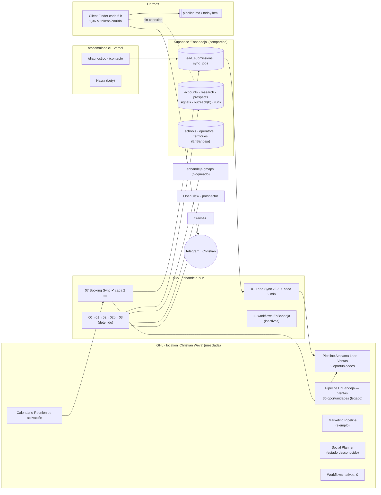
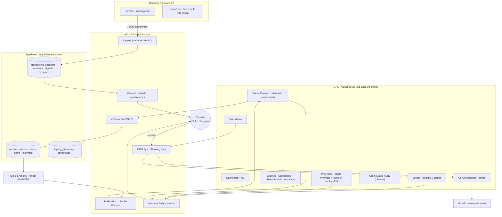
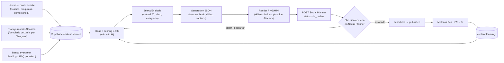

# Atacama OS — Diagnóstico (fase 1, solo lectura)

**Fecha:** 5-oct-2026 · **Modo:** READ ONLY. No se configuró, modificó, borró, activó, desactivó ni migró nada. No se publicó ni se envió ningún correo. No hubo commits de implementación (este archivo y el anexo técnico `AUTOMATION-OPERATING-SYSTEM-AUDIT.md` quedan sin commit).

**Qué se revisó realmente**

| Fuente | Cómo | Cobertura |
|---|---|---|
| GitHub `main` (HEAD `2ccbf2a`) | Lectura local del repo | Completa |
| GHL (location real) | API v2 con los 2 tokens configurados (solo `GET`) + navegador de Christian (sesión ya abierta, solo lectura) | **Parcial**: ver "Límites" |
| n8n | API de lectura (21 workflows, últimas 2.000 ejecuciones) | Completa salvo la lista de credenciales (la API pública no la expone) |
| Supabase `uwquwjmiofixzugttals` | Consultas `SELECT` y listados | Completa |
| VPS | SSH de solo lectura: wrappers de `hermes-ops` (Hermes) y, para Docker/OpenClaw, la llave `.ssh_enbandeja_ops` con comandos de lectura | Completa |
| Documentación oficial y blogs | Meta, LinkedIn, GHL (help center y marketplace), Remotion | Ver fuentes por sección |

**Límites de este diagnóstico (lo que NO pude comprobar, y por qué)**

1. **Social Planner, Custom Objects, Associations, Companies, Tags, Custom Values, Forms, Funnels, Tasks, Snapshots:** ambos tokens de GHL responden `401 – no autorizado para este scope`. No es que no existan: es que el token no puede verlos.
2. **Navegador:** logré entrar a tu cuenta de GHL (sesión activa; la marca blanca de la app se titula "Imperio Digital"), ver el menú lateral y el Dashboard, pero **los paneles de Marketing > Social Planner, Automation, Settings > Objects y Email Services se quedaron cargando sin mostrar contenido** durante más de 30 s en cada intento. Lo dejé así en lugar de insistir.
3. **Cuentas de Instagram y LinkedIn conectadas a Social Planner:** sin verificar (consecuencia de 1 y 2).
4. **Gmail en GHL / Email Services, Project Management, Agent Studio, Dashboards guardados:** sin verificar.
5. **Snapshots:** se crean y comparten a nivel de agencia; ninguno de los tokens tiene acceso de agencia.

Cierre propuesto para esos puntos: sección 23, decisión 2 (ampliar scopes de solo lectura o 20 minutos de pantalla compartida).

---

## 1. Executive Summary

**Dónde estamos.** El motor de ventas "de entrada" (formulario → Supabase → GHL → reunión) funciona solo y sin errores: 2.000 ejecuciones seguidas. Todo lo demás —prospección, contenido, clientes, proyectos— o está construido y detenido, o vive fuera de GHL: prospectos en archivos de Hermes, trabajo de contenido en el scratchpad de una sesión, clientes y proyectos en ninguna parte.

**Cuánto está construido.** Mucho más de lo que se ve desde GHL. En n8n hay 11 workflows de Atacama (5 desplegados y 3 solo como JSON) y en Supabase un motor de prospección horizontal probado de punta a punta con datos ficticios. En GHL, en cambio, hay **3 pipelines, 43 contactos, 42 oportunidades, 0 workflows nativos y 1 calendario de Atacama**. GHL hoy es un espejo de leads, no el centro operativo.

**Mayor problema.** **Atacama se construyó encima de EnBandeja y todavía vive adentro de ella.** El 95 % de lo que hay en GHL no es de Atacama: 36 contactos y 36 oportunidades son de EnBandeja, y el resto son 5 contactos sin origen y 4 oportunidades de ejemplo de GHL (Atacama tiene 2 y 2); el n8n, el Supabase, el pipeline de GHL, los campos personalizados, el contenedor del scraper y hasta el nombre del proyecto en el servidor se llaman `enbandeja-*`. Mientras eso siga mezclado, configurar Atacama OS (dashboards, snapshot) copiaría la contaminación a cada cliente.

**Mayor oportunidad.** GHL ya trae nativo casi todo lo que Atacama OS necesita, así que **no hay que construir ni comprar nada**: Companies, Opportunities, Custom Objects (hasta 10 por location en todos los planes, 300.000 registros por objeto) con Associations, Project Management (Spaces / Lists / Tasks / Kanban), Tareas asociables a varios objetos, Dashboards con widgets de objetos personalizados, **Social Planner con API pública** (crear posts en borrador, en revisión o programados), Snapshots que arrastran pipelines, workflows, calendarios, campos y objetos, y un servidor MCP oficial. Además, **publicar a través de Social Planner evita crear una app de Meta y esperar la aprobación del Community Management API de LinkedIn**, porque GHL ya es un integrador aprobado (a confirmar con la cuenta conectada).

**Camino recomendado (resumen).** (1) Cerrar los 2 huecos de seguridad y apagar el desperdicio; (2) **etiquetar y archivar EnBandeja sin borrar nada**; (3) configurar GHL (pipeline Atacama de 9 etapas, Companies, objetos *Servicio contratado* y *Proyecto*, dashboard "Hoy"); (4) conectar la prospección real (Hermes → Supabase → GHL) con el gate de calidad; (5) Gmail con dominio secundario; (6) contenido diario con GHL Social Planner como calendario y n8n como motor; (7) construir un *sub-account plantilla limpio* y de ahí el **Atacama OS V1 Snapshot**.

---

## 2. Inventario actual

| Componente | Existe | Estado | Uso actual | Observaciones |
|---|---|---|---|---|
| **GHL – location "Christian Weva"** | Sí | ACTIVO | Único location; contiene EnBandeja y Atacama | Zona horaria **UTC** (negocio en Chile); nombre con typo ("Weva"); marca blanca "Imperio Digital" |
| GHL – pipelines | 3 | ACTIVO | `Atacama Labs — Ventas` (2 oportunidades), `EnBandeja — Ventas` (36), `Marketing Pipeline` (4, ejemplo de GHL) | Atacama: 6 etapas, no coincide con el modelo objetivo de 9 |
| GHL – contactos | 43 | ACTIVO | 36 de EnBandeja (35 CSV + 1), 2 de `atacama-labs-web`, 5 sin fuente | `Sushi72` y `Delicor` existen como 1 contacto cada uno; no hay objeto Cliente ni Proyecto |
| GHL – oportunidades | 42 | ACTIVO | Ver arriba | 23 de EnBandeja en "Contactado" abiertas, 8 "Respondió/lost" |
| GHL – campos personalizados | 12 | ACTIVO | Contacto: 1. Oportunidad: 11, de los cuales 8 son de EnBandeja (Schools Count, Operator Relation, Platform Status, Manual Process Count/Verified, etc.) | Los de Atacama: Fuente, Solución de interés, Lead ID |
| GHL – Companies | No verificable | — | Los 43 contactos traen `companyName`, pero el scope de Companies no está habilitado | Probablemente no se usa el objeto Company |
| GHL – workflows nativos | **0** (según API) | — | Todo el automatismo está en n8n | Verificar en la interfaz |
| GHL – calendarios | 3 | ACTIVO | "Reunión de activación" (Atacama); 2 "Personal Calendar" duplicados de Christian | Horas en UTC |
| GHL – Social Planner | Sí (location tiene `social: true`) | **No verificable** | Cuentas conectadas desconocidas | Ver Límites |
| GHL – Custom Objects / Project Management / Dashboards / Agent Studio / Snapshots | Desconocido | **No verificable** | El menú de Settings muestra "Objects", "Custom Fields", "Private Integrations", "Labs"; el Dashboard muestra los widgets por defecto | Sin evidencia de uso |
| GHL – Private Integrations | 2 tokens | ACTIVO | `Atacama Labs — Web` (propio) y `OpenClaw — EnBandeja` (compartido con el agente aliado) | Mismo location para ambos |
| GHL – usuarios | 2 (ambos admin) | ACTIVO | — | — |
| GHL – conversaciones | 43 | ACTIVO | Todas de tipo teléfono; **ninguna de correo** | Gmail no está conectado a conversaciones |
| **n8n** (`enbandeja-n8n`) | Sí | ACTIVO | 21 workflows; solo Lead Sync v2.2 y Booking Sync corren solos | Ver sección 4 |
| **Supabase** (proyecto compartido) | Sí | ACTIVO | 15 tablas, 6 funciones, 7 triggers | 2 tablas sin RLS |
| **Hermes** (v0.20.4+) | Sí | ACTIVO | 1 cron activo (Client Finder), 19 inactivos | No escribe en Supabase ni GHL |
| **OpenClaw** (2026.7.1-2) | Sí | ACTIVO | 6 agentes (4 no son de Atacama), 3 crons ajenos | UI pública en puerto 61460; Chromium descontrolado |
| Crawl4AI (`crawl4ai-stii`) | Sí | ACTIVO | Scraping de 02 Research | Contenedor de otro proyecto ("stii"); puerto público con auth |
| `enbandeja-gmaps` | Sí | ACTIVO pero sin resultados | Discovery de Atacama depende de él | Los jobs quedaron `pending` en 4 intentos |
| Traefik | Sí | ACTIVO | HTTPS de n8n | Router llamado `enbandeja-n8n` |
| Sitio atacamalabs.cl (Vercel) | Sí | ACTIVO | 16 landings, formularios, Nayra | Código limpio de EnBandeja |
| Nayra / Lety | Sí | ACTIVO | Widget del sitio | Parche iOS propio |
| **Gmail / Google Workspace** | **No** | BLOQUEADO | Sin credencial en ningún workflow, en Hermes ni en OpenClaw | 06 Gmail Sync es un esqueleto |
| Instagram `@atacama.labs` | Cuenta | Manual | Publicaciones a mano | Sin integración |
| LinkedIn (empresa/personal) | Sin confirmar | — | Sin integración | — |
| Telegram | 4 bots OpenClaw + 1 Hermes | ACTIVO | Para otros fines | Falta un bot para Atacama OS |
| GitHub `atacamalabs` | Sí | ACTIVO | Código y n8n JSON | Documentación n8n fuera de sincronía en un punto (ver 4) |

---

## 3. GHL actual

### CRM, pipelines y datos

| Pipeline | Etapas | Oportunidades | Pertenece a |
|---|---|---|---|
| **Atacama Labs — Ventas** | Nuevo → Contactado → Diagnóstico → Propuesta → Seguimiento → Cerrado | 2 abiertas en Nuevo | Atacama |
| **EnBandeja — Ventas** | Nuevo HOT → Contactado → Respondió → Diagnóstico → Demo → Propuesta → Seguimiento | 36 (23 Contactado abiertas, 8 Respondió/lost, 2 Diagnóstico, 1 Demo, 1 Propuesta, 1 Seguimiento) | **EnBandeja** |
| Marketing Pipeline | New Lead → Contacted → Qualified → Proposal Sent → Negotiation → Closed | 4 (1 won, 1 abandoned, 2 open) | Plantilla de ejemplo de GHL |

- **Reutilizable:** `Atacama Labs — Ventas` ya existe y está conectado a Lead Sync y Booking Sync (IDs de pipeline y de etapas fijados en `icp_packs.crm`). No hay que crear otro pipeline; hay que **extenderlo**.
- **Diferencias frente al modelo objetivo** (Nuevo → Investigado → Contactado → Respondió → Diagnóstico → Propuesta → Seguimiento → Ganado → Perdido): faltan **Investigado** y **Respondió**; "Cerrado" debe reemplazarse. En GHL, ganado/perdido son *estados* (`won`/`lost`), no etapas, y los reportes nativos dependen de ellos; recomiendo mantener esos estados y no crear etapas Ganado/Perdido.
- **Datos:** los 43 contactos tienen empresa pero 41 correo y solo 5 teléfono. Los 2 de Atacama vienen del formulario web.
- **Conversaciones:** 43, todas de tipo teléfono (creadas por contacto). Ninguna de correo: GHL nunca envió ni recibió correo de esta cuenta.

### Clientes y proyectos
No existen. No hay objeto Cliente, Servicio ni Proyecto, y nada indica uso de Project Management. `Sushi72` y `Delicor` solo están como contactos individuales.

### Social Planner
La location tiene Social Planner habilitado (`social: true`). **No se pudo ver si hay cuentas conectadas ni publicaciones.** Lo que sí está documentado oficialmente:
- Endpoint `POST /social-media-posting/:locationId/posts` con `type` = `post` | `story` | `reel`, `status` = `draft` | `scheduled` | `in_review` | `published` | `failed`…, `scheduleDate`, `accountIds`, medios, etiquetas y categoría; el pie de foto se recorta al límite más estricto entre plataformas (Instagram y TikTok 2.200 caracteres, LinkedIn 3.000).
- Scopes necesarios: `socialplanner/account.readonly`, `socialplanner/post.readonly`, `socialplanner/post.write`, `socialplanner/oauth.*`. El token actual no los tiene.
- OAuth de conexión para Facebook, Google, LinkedIn y TikTok (Instagram entra vía página de Facebook).

### Dashboards, calendario, workflows, Agent Studio
- **Dashboard:** se ve el dashboard por defecto (estado de oportunidades, valor, conversión, embudo, distribución de etapas). Sin evidencia de dashboards propios.
- **Calendario:** "Reunión de activación" (30 min, slug `reunion-de-activacion`) funciona y está sincronizado por 07. Hay 2 calendarios personales duplicados de Christian.
- **Workflows nativos:** la API devuelve 0. Toda la lógica está en n8n.
- **Agent Studio:** el menú lateral muestra "AI Agents"; no se pudo abrir. Según documentación pública (fuentes secundarias), Agent Studio y un servidor MCP oficial de HighLevel (junio 2026, unas 21 herramientas: contactos, conversaciones, oportunidades, calendarios, pagos, social, blogs, plantillas de correo) están disponibles en los planes Unlimited y SaaS Pro; hay que confirmar tu plan.

### Snapshot readiness
Hoy el location **no es apto como origen de snapshot**: mezcla EnBandeja, trae ejemplos de GHL, usa campos de otra vertical, tiene zona horaria UTC y calendarios personales. Un snapshot sale de un sub-account *limpio* (sección 19).

---

## 4. n8n actual

21 workflows (6 con `active: true`, de los cuales solo 2 tienen schedule). Detalle completo con IDs en el anexo [`AUTOMATION-OPERATING-SYSTEM-AUDIT.md`](AUTOMATION-OPERATING-SYSTEM-AUDIT.md) §2.3. Resumen por etapa del pipeline de Atacama:

| Workflow | Existe | Activo | Probado | Producción | Dependencias | Problemas |
|---|---|---|---|---|---|---|
| 00 Orchestrator | Sí (`ubXANtYTd5y9wdbP`) | No | Sí (16-sep) | No | 4 sub-workflows PROD | Sin schedule; se detiene antes de 04 por diseño |
| 01 Discovery | Sí (PROD `AnjrmngEzXWiXIVT`) | Sí* | Mecánica sí, escritura real **no** | No | `enbandeja-gmaps` | **Bloqueado** por el scraper; código con restos de "school/operator" |
| 02 Research | Sí (PROD `cw3oTblethuiTtEm`) | Sí* | Sí | Parcial (2/25 cuentas) | Crawl4AI, OpenClaw | Credenciales compartidas de EnBandeja; ~7 min por empresa; 64 menciones de `school` en su código |
| 02b Signals | Sí (PROD `liNLmszWOlEz9kVv`) | Sí* | Sí | Parcial | OpenClaw | Credencial compartida |
| 03 Qualification | Sí (PROD `LzkojauO5ypKNALc`) | Sí* | Sí (datos ficticios) | **0 prospects reales** | Supabase | Nunca calificó una cuenta real de Atacama |
| 04 CRM Sync | Solo JSON en el repo | **No desplegado** | Sí (copia desechable, borrada) | No | GHL, Supabase | Hay que desplegarlo |
| 05 Outreach Draft | Solo JSON | **No desplegado** | Sí | No | OpenClaw, Supabase | Idem |
| 06 Gmail Sync | Solo JSON (esqueleto) | No | No | No | **Credencial Gmail inexistente** | Bloqueado, sigue siendo cierto |
| 07 Booking Sync | Sí (`sw0xbhB91s5mhHCh`) | **Sí** | Sí | **Sí** (999/999 OK) | GHL Calendars | Polling cada 2 min; horas en UTC |
| 01 Lead Sync v2.2 | Sí (`idniXY0Du2qet57O`) | **Sí** | Sí | **Sí** (1.001/1.001 OK) | GHL, Supabase | Polling cada 2 min para ~3 leads totales |

\* "Activo" solo para poder ser invocado por el orquestador.

**Documentación desactualizada frente a lo real:** `n8n/README.md` dice que 04/05 están "probados bajo atacama-labs real" y los presenta como parte del sistema; en la instancia **no existen**. También afirma "no se dejó ningún workflow activo permanentemente", lo cual dejó de ser cierto con Lead Sync y Booking Sync.

**Workflows de EnBandeja todavía presentes (11, todos inactivos):** `00 Daily Prospecting Orchestrator V1` (cron `0 6 * * *` apagado), `01 Discovery Engine`, `01 Discovery Engine v3 GEO`, `01b Import Closed Universe`, `02 Research Engine FINAL`, `02b Signals Engine`, `03 Qualification Engine V1`, `04 GHL Intake V1.2`, y 3 benchmarks de triage. Clasificación en la sección 9.

---

## 5. OpenClaw actual

- **Estado:** contenedor sano 4 semanas, ~50 % de CPU y 2,3 GB de RAM. Un proceso Chromium descontrolado (desde el 7-sep, ~36 % de CPU sostenido) lo explica. UI publicada en `0.0.0.0:61460` (responde 200 desde internet).
- **Agentes (6):** `main` (JARVIS), `cody`, `sanluis` (Luchito), `familia` (Yoyo) — personales o de otros negocios — más `prospector` y `enbandeja-triage` (`openai/gpt-5.5`).
- **Modelos:** por defecto `openai/gpt-5.5` (OAuth Codex), 5 respaldos gratuitos de OpenRouter, 38 modelos configurados (NVIDIA NIM, OpenRouter). Cuota Codex al momento: 95 % libre en 5 h, **48 % libre en la semana**.
- **Tools / skills:** 109 skills (72 listas), incluida una biblioteca de marketing (copywriting, ab-testing, ads, ai-seo, cro). Telegram con 4 bots; sin Instagram, LinkedIn ni correo.
- **Tareas:** 3 crons (Cierre Operativo Diario, Memory Dreaming, Revisión Semanal), ninguno de Atacama.
- **Uso desde n8n:** `http://openclaw-gateway:18790` en 02 Research, 02b Signals y 05 Outreach Draft, con el agente `prospector`.
- **Residuos:** el workspace contiene `enbandeja/`, `enbandeja-triage/`, `sanluis/enbandeja-prospecting/` (con `STATE.md`, `candidates.csv`, informes diarios de jul-ago), `dental-prospecting/` y decenas de proyectos ajenos (CoachPAES, Citalia, PsicoVida…).
- **Duplicación:** `prospector` hace lo mismo que Hermes con `opportunity-builder`.

## 6. Hermes actual

- **Estado:** 2 contenedores sanos 6 semanas. Modelo `gpt-5.6-luna` por Codex OAuth (token renovado hoy), respaldo OpenRouter. Telegram configurado; sin WhatsApp, Discord ni Slack. Sin claves de Firecrawl, Tavily, GitHub, FAL ni ElevenLabs. **Sin credencial de Google** (tampoco Gmail).
- **Skills:** `opportunity-builder`, `personal-agent-radar` (propias) y ~80 incluidas (creativas, de investigación, de desarrollo).
- **Cron (20 jobs):** **1 activo** — `Atacama Labs — Client Finder`, cada 6 h, con `opportunity-builder` + `grounded-citations`; última corrida hoy, **1,36 M de tokens de entrada, 890 s**. 9 completados (investigaciones puntuales de ago-sep, incluida `enbandeja-prospecting-review`) y 10 pausados (entre ellos los 3 de la línea base V2).
- **Salida:** `atacama-sales-pipeline.md` (174 líneas, 10 prospectos de hoy con contacto, señal, oferta, mensaje y precio), `atacama-sales-today.html` y 3 listados HTML anteriores (50, 30 y 50 prospectos). **Ninguna escritura a Supabase ni GHL.**
- **Webhooks:** no hay entrada (sin dominio HTTPS propio); `hermes-health-watch` pausado.
- **Herramientas de salida:** ninguna herramienta de envío (por diseño); navegador de propósito general sin barrera técnica de publicar/comprar.

---

## 7. Supabase actual

Proyecto `uwquwjmiofixzugttals` (nombre "Enbandeja", sa-east-1), compartido.

| Grupo | Tablas | Qué guardan hoy | Nota |
|---|---|---|---|
| **Entrada web (Atacama)** | `lead_submissions` (3), `sync_jobs` (3) | Formularios y cola hacia GHL | Funciona |
| **Motor horizontal** | `icp_packs` (7), `accounts` (2.711), `research` (1.002), `contacts` (210), `signals` (15), `prospects` (89), `outreach` (0), `runs` (11) | Cuentas, evidencia, señales, calificación | Atacama: 25 cuentas, 6 señales, **0 prospects** |
| **EnBandeja original** | `schools` (2.654), `operators` (76), `territories` (80), `leads` (0), `_backup_prospects_pre_operator_required_20260903` (62) | Colegios y concesionarias | **Sin RLS** en el backup y en `runs` |

- **Funciones:** `claim_sync_jobs`, `complete_sync_job`, `enqueue_prospect_sync`, `create_lead_submission`, `set_updated_at`, y `complete_territory_scan` (EnBandeja). 7 triggers (`*_set_updated_at`).
- **Por pack:** `casino-escolar` 2.134 cuentas / 62 prospects (36 con oportunidad en GHL); `clinicas-dentales-cl` 309 / 24; `clinica-dental-piloto` 103; `arriendo-eventos-cl` 88 / 3; `centros-esteticos-cl` 52; `atacama-labs` 25 / 0.
- **Qué debería guardar:** investigación y calificación *antes* de que el prospecto entre al CRM (`accounts`, `research`, `signals`, `prospects`), logs de ejecución, el esquema nuevo de contenido (ideas, fuentes, aprendizajes) y cualquier dato que GHL no deba contener (evidencias, puntajes, prompts). **No** debería ser la fuente de verdad de contactos aprobados, clientes, proyectos ni publicaciones.
- **Hallazgo de seguridad vigente:** `runs` y `_backup_prospects…` sin Row Level Security (alerta crítica del propio Supabase). Remedio sugerido por Supabase (no aplicado): `ALTER TABLE … ENABLE ROW LEVEL SECURITY;`.

---

## 8. Gmail actual

**Sigue siendo cierto que está bloqueado.**
- n8n: ningún workflow usa un nodo ni credencial de Gmail; `06 Gmail Sync` es un esqueleto que lanza error a propósito. (La API pública de n8n no lista credenciales; la conclusión sale de los nodos de los 21 workflows.)
- Hermes: sin credencial de Google (el estado muestra "Google / Gemini: no configurado" y no hay archivos de OAuth). El conector de Gmail de Claude está desconectado.
- GHL: las 43 conversaciones son de teléfono; **Email Services** no se pudo abrir en el navegador, así que no sé si hay dominio de envío configurado.
- Lo que sí existe: el esquema `outreach` (0 filas) con `gmail_message_id`, `gmail_thread_id`, `sent_at`, `replied_at`, y el diseño de 05 (solo borradores) y 06 (solo leer).
- **Para cumplir lo que pides** (enviar aprobados, conservar el hilo, detectar respuestas, detener seguimientos, actualizar GHL, alertar) faltan: una casilla en un dominio de envío, una credencial OAuth en n8n, 06 completado y una regla "respuesta ⇒ cancelar seguimientos".

---

## 9. EnBandeja Legacy Audit

A = eliminar/renombrar · B = reutilizado (válido y genérico) · C = dependencia compartida · D = datos legados

| Recurso | Dónde | Tipo | Qué hacer posteriormente | Riesgo |
|---|---|---|---|---|
| Pipeline `EnBandeja — Ventas` (36 oportunidades) | GHL | **D** | Etiquetar `legacy:enbandeja`, no borrar; decidir (ver decisión 1): archivar, mantener vivo o mover a otro sub-account. 23 siguen abiertas en "Contactado" | **Alto**: puede haber conversaciones vivas |
| 36 contactos con fuente `EnBandeja Prospecting*` | GHL | **D** | Etiqueta + segmento; excluir de reportes de Atacama | Medio |
| Campos de oportunidad: *Schools Count, Operator Relation, Platform Status, Manual Process Count, Manual Process Verified* | GHL | **A/D** | Dejar de usarlos en Atacama; archivar con el pipeline | Bajo |
| Campos de oportunidad: *Prospect Key, Qualification Score, Commercial Angle* | GHL | **B** | Mantener (genéricos) | Bajo |
| `Marketing Pipeline` + 5 contactos sin fuente (etiquetas "high priority", "follow-up", "warm lead") | GHL | **A** (ejemplos de GHL) | Confirmar que son de ejemplo y eliminar en la fase de limpieza | Bajo |
| Private Integration `OpenClaw — EnBandeja` (token compartido con n8n de EnBandeja y el agente aliado) | GHL | **C** | Mantener mientras EnBandeja exista; Atacama usa su propio token (`Atacama Labs — Web`). El `.env.local` local guarda ambos | Medio (revocar acopla producción y aliado) |
| Nombre de la location "Christian Weva", marca "Imperio Digital", zona horaria UTC | GHL | **A** | Renombrar a Atacama Labs; zona horaria a `America/Santiago` (afecta calendarios y horas de 07) | Medio (horas de reuniones) |
| 2 calendarios "Christian Wevar's Personal Calendar" | GHL | **A** | Limpiar o dejar fuera de Atacama | Bajo |
| 8 workflows EnBandeja (`00`–`04`, `01b`) + 3 benchmarks | n8n | **A/D** | Mover a carpeta/etiqueta `Legacy-EnBandeja`; exportar JSON; borrar solo con aprobación | Bajo (inactivos) |
| Código heredado dentro de workflows PROD de Atacama: `school` (64 menciones en 02 Research), `operator`, `colegio` (01 Discovery) | n8n | **A** | Reescribir nombres y vocabulario; probar con copia desechable | Medio |
| `http://enbandeja-gmaps:8080` (scraper de Maps) | n8n → VPS | **C** | Documentar; reemplazar por Hermes o renombrar el servicio a `gmaps-scraper` con alias de red | Medio-alto (rompe Discovery) |
| Credenciales `Header Auth account` y `Header Auth account 2` (OpenClaw, Crawl4AI) compartidas | n8n | **C** | Crear credenciales propias de Atacama (pendiente U17) | Bajo |
| Contenedor `enbandeja-n8n`, router Traefik `enbandeja-n8n`, carpeta `/opt/enbandeja-prospecting/n8n` | VPS | **C** (A en nombre) | Renombrar en ventana de mantenimiento (afecta URLs de webhooks y labels) | **Alto** |
| Usuario SSH `enbandeja-ops` (grupo `docker`, equivale a root) y llave `.ssh_enbandeja_ops` | VPS | **A/C** | Reemplazar por usuario de mínimo privilegio como `hermes-ops`; esta auditoría lo usó solo para lecturas | Medio |
| Contenedor `crawl4ai-stii-crawl4ai-1` | VPS | **C** | Servicio de otro proyecto ("stii") usado por Atacama; documentar dueño | Bajo |
| Agente `enbandeja-triage`, workspaces `enbandeja/`, `sanluis/enbandeja-prospecting/`, `dental-prospecting/` | OpenClaw | **D** | Archivar | Bajo |
| Agente `prospector` | OpenClaw | **B** | Mantener hasta reemplazar su rol; renombrar a `research-agent` | Medio |
| `HERMES.md` y 5 archivos con "EnBandeja"; job `enbandeja-prospecting-review` | Hermes | **A/D** | Neutralizar `HERMES.md`; archivar archivos | Bajo |
| Proyecto Supabase llamado "Enbandeja" | Supabase | **C/A** | Separar en proyecto propio (ver abajo) o renombrar | **Alto** si se migra |
| Tablas `schools`, `operators`, `territories`, `leads`; función `complete_territory_scan`; columnas `legacy_school_id` / `legacy_operator_id` | Supabase | **D** | Mantener intactas; segregar por esquema o proyecto | Alto |
| Packs `casino-escolar` (2.134 cuentas, 62 prospects), `clinica-dental-piloto`, `clinicas-dentales-cl`, `centros-esteticos-cl`, `arriendo-eventos-cl` | Supabase | **D** (otras verticales) | Dejar pausados; el pack de clínicas dentales (309 cuentas) es **reutilizable** para Atacama (B) | Medio |
| Constraint `hot_requires_v1_gates` y lógica `operator_required` | Supabase | **B** | Ya generalizado (`operation_current = company_verified`); renombrar a algo neutro | Medio |
| `_backup_prospects_pre_operator_required_20260903` | Supabase | **D** | Mantener hasta confirmar que no se usa; **habilitar RLS ya** | Medio (datos expuestos) |
| Comentarios "EnBandeja", `cantidad_colegios`/`tiene_cafeteria` en 4 migraciones; README de n8n; `atacama-labs-01-discovery.json` | Repo | **A** | Actualizar comentarios y docs (29 coincidencias en 7 archivos) | Bajo |
| Carpetas `EnBandeja-GHL-Setup`, `EnbandejaGHL-context` (fuera del repo) | Disco local | **D** | Archivar | Bajo |
| Menciones de colegios y casinos en el sitio (rubros "Educación" y "Alimentación/Casinos") | Repo (`industries.ts`, `agents.ts`) | **No es legado** | Son rubros comerciales legítimos de Atacama | — |

---

## 10. Duplicaciones

| # | Duplicación | Evidencia | Propuesta |
|---|---|---|---|
| 1 | **Dos motores de prospección** | n8n + OpenClaw `prospector` (bloqueado, detenido) vs Hermes Client Finder (activo, aislado) | Uno solo escribe en Supabase: Hermes como investigador, n8n como orquestador (ver 15) |
| 2 | **Tres planificadores sin coordinar** | n8n (2 polls + crons apagados), Hermes (1 activo + 19 inactivos), OpenClaw (3 crons) | n8n programa todo lo que toca el mundo exterior; el cron de Hermes se limita a investigar |
| 3 | **Tres generaciones de crons de prospección en Hermes** | Outbound Loop → Misión 2 → Client Finder, más Pain Signals y Antofagasta Maps 50 | Archivar los 19 inactivos; dejar uno |
| 4 | **Cuatro versiones de Lead Sync** | v1, v2, v2.1 desactivadas; v2.2 activa | Archivar las 3 |
| 5 | **Dos tokens de GHL en el mismo location** | `Atacama Labs — Web` y `OpenClaw — EnBandeja` | Cada negocio su token; si EnBandeja se separa, el compartido se revoca solo ahí |
| 6 | **Dos pipelines que no son de Atacama en el mismo location** | `EnBandeja — Ventas`, `Marketing Pipeline` | Sección 9 |
| 7 | **Contactos en Supabase y GHL** | `contacts` (210) y GHL (43) se solapan en las 36 de EnBandeja | Regla: Supabase guarda investigación *previa*; a GHL solo entra lo aprobado; nunca editar el mismo contacto en ambos |
| 8 | **Lista de prospectos en archivo (Hermes) y tabla (Supabase)** | `atacama-sales-pipeline.md` vs `prospects` | La tabla es la fuente; el archivo pasa a ser una vista de lectura |
| 9 | **Gestor de proyectos propio vs Project Management de GHL** | Hoy no hay ninguno, pero el plan original proponía tablas | No crear tablas de proyectos en Supabase; usar GHL |
| 10 | **Social Planner vs publicar directo por API de Meta/LinkedIn** | Mi anexo técnico proponía publicar con APIs oficiales desde n8n | Usar Social Planner como publicador; evitar app de Meta propia y aprobación de LinkedIn (si la cuenta conecta las redes) |
| 11 | **Dos "chiefs of staff" por Telegram** | `personal-agent-radar` (pausado) y "Cierre Operativo Diario" de OpenClaw | Elegir uno; el de Atacama es el *Atacama Daily* |
| 12 | **Calendarios personales duplicados** | 2 "Personal Calendar" | Limpiar |
| 13 | **Campos duplicados** | Cada pack guarda `final_score` en `prospects` y "Qualification Score" en GHL | Mantener (el segundo es una copia de lectura), documentándolo |

---

## 11. Arquitectura actual

---

## 12. Arquitectura objetivo Atacama OS

Principios: **GHL es lo que Christian mira y toca; n8n es el único que ejecuta cosas externas; Supabase guarda lo que GHL no debe guardar; los agentes entregan datos estructurados, nunca archivos sueltos.**

---

## 13. Fuente de verdad por dominio

| Dominio | Fuente de verdad propuesta | Notas |
|---|---|---|
| Contactos (personas aprobadas, leads, clientes) | **GHL Contacts** | Supabase guarda solo contactos *investigados* antes de aprobar |
| Empresas | **GHL Companies** (cliente o prospecto aprobado) | Supabase `accounts` = empresas en investigación, enlazadas por `ghl_company_id` |
| Oportunidades | **GHL Opportunities** | Un solo pipeline de Atacama |
| Clientes | **GHL**: Company + Opportunity ganada + objeto *Servicio contratado* (MRR, implementación, inicio, estado, próximo paso) | No duplicar en tablas propias |
| Proyectos | **GHL**: objeto *Proyecto* (cliente, estado, responsable, prioridad, fechas, hito, repo, deployment) + **Tasks** asociadas; Kanban de Project Management si resulta mejor | Decidir tras ver Project Management en la UI |
| Prospección – research y scoring | **Supabase** | Evidencia, señales, puntajes, prompts, logs |
| Contenido (fuentes, ideas, copy, aprendizajes) | **Supabase `content`** | Con `ghl_post_id` por pieza |
| Publicaciones (calendario, estado, aprobación) | **GHL Social Planner** | Estados `draft`/`in_review`/`scheduled`/`published` |
| Archivos de piezas (PNG/MP4) | **Supabase Storage** (URL pública) o GHL Media Storage | A decidir; IG/LinkedIn necesitan URL accesible |
| Métricas sociales | **Social Planner** si su API entrega estadísticas; si no, **Supabase** (`publication_metrics`) con un resumen en el Atacama Daily | Por verificar |
| Reuniones | **GHL Calendars** | Booking Sync ya lo conecta |
| Correo (hilos) | **Gmail**, reflejado en GHL Conversations | |
| Código | **GitHub** (`atacamalabs`, `main`) | |
| Automatizaciones de integración y de IA | **n8n** | |
| Automatizaciones *dentro* del CRM (tarea al cambiar de etapa, avisos) | **GHL Workflows** | Regla: n8n para lo externo/IA, GHL para lo interno |
| Conocimiento de agentes (skills, prompts) | **Hermes** + repo | |
| Competencia monitoreada | **Supabase `content.competitor_content`** | |

---

## 14. Gap Analysis

Esfuerzo: **S** < ½ día · **M** 1-3 días · **L** 1-2 semanas.

| Necesidad | Tenemos | Falta | Prioridad | Esfuerzo |
|---|---|---|---|---|
| Cerrar huecos de seguridad (RLS, puerto OpenClaw) | Diagnóstico | Ejecutar con tu OK | **P0** | S |
| Separar EnBandeja de Atacama | Inventario (sección 9) | Decisión + etiquetado/archivo | **P0** | M |
| Ver los módulos de GHL que no pude abrir | Lista de scopes | Scopes de solo lectura o pantalla compartida | **P0** | S |
| Pipeline Atacama de 9 etapas | Pipeline de 6 etapas | Agregar *Investigado* y *Respondió*; won/lost como estado; reasignar los IDs en `icp_packs.crm` | **P1** | S |
| Companies y modelo de cliente | Solo contactos | Companies + objeto *Servicio contratado* + asociaciones + "ganado ⇒ cliente" | **P1** | M |
| Proyectos | Nada | Objeto *Proyecto* + Tasks (+ Project Management si aporta) | **P1** | M |
| Dashboard "Hoy" | Widgets por defecto | 8-10 widgets (pipeline, tareas, reuniones, proyectos, MRR, publicaciones) | **P1** | S |
| Prospección real hasta 20/día | Hermes produce 10 por corrida, fuera del sistema | Ingesta Hermes → Supabase + gate; desplegar 04/05 | **P1** | M-L |
| Gmail (envío, hilos, respuestas, bajas) | Nada | Dominio secundario, OAuth, 06 completo, regla "respuesta ⇒ detener" | **P1** | L |
| Contenido diario | Nada automático | Esquema `content`, motor, render, aprobación | **P1** | L |
| Social Planner conectado | Habilitado, estado desconocido | Conectar IG/LinkedIn; scopes `socialplanner/*`; probar crear borrador | **P1** | S-M |
| Atacama Daily | Nada | Workflow n8n + checks de salud | **P2** | M |
| Alertas de fallo (job `failed`, workflow caído, cuota) | Ninguna | Flujo de error global | **P2** | S |
| Reducir desperdicio (polling, Client Finder, cron inactivos) | — | Ajustes de frecuencia y archivado | **P2** | S |
| Renombrar infraestructura `enbandeja-*` | — | Ventana de mantenimiento + plan de rollback | **P3** | M |
| Template limpio + Snapshot V1 | Nada | Sub-account plantilla, prueba de despliegue | **P2** | L |
| Competidores (Business Discovery, `/competidor`) | Investigación manual | Workflow + tablas | **P3** | M |
| Mascota y guía de publicaciones | No encontradas en el repo ni en los ZIP de identidad | Ubicación del archivo | **P2** | S |
| Datos legales (`/privacidad`) | Pendiente | Razón social, RUT, domicilio | **P2** (requisito de correo en frío) | S |

---

## 15. GHL Configuration Plan (SIN ejecutar)

Cada ítem queda para la fase 2 y requiere aprobación individual. Se prueba primero en un sub-account de pruebas, no en producción.

### Dashboard
Dashboard "Atacama OS — Hoy" con: estado de oportunidades y valor (solo pipeline Atacama), distribución por etapa, conversión, tareas vencidas/de hoy, reuniones de hoy y de la semana, proyectos activos por estado (widget de objeto personalizado), MRR (suma de *Servicio contratado* activos), publicaciones programadas y en revisión, y un widget de alertas (tareas con etiqueta `alerta`). Máximo ~10 widgets. Fuentes secundarias indican que los widgets de objetos personalizados admiten contadores, donuts y tablas.

### Pipeline
Etapas de `Atacama Labs — Ventas`: **Nuevo → Investigado → Contactado → Respondió → Diagnóstico → Propuesta → Seguimiento**; ganado/perdido por *estado* (`won`/`lost`) con motivo de pérdida obligatorio (campo). Quitar "Cerrado" solo después de migrar las 2 oportunidades y de actualizar `icp_packs.crm` y 07 Booking Sync (que mueve a *Diagnóstico* por ID). No se toca el orden de etapas existentes que usan los workflows.

### Clients
- Activar y usar **Companies**; asociar contactos y oportunidades.
- Regla: *oportunidad ganada ⇒ Company marcada como cliente + creación del objeto Servicio contratado + proyecto inicial con tareas plantilla* (workflow GHL nativo disparado por el estado `won`).
- Contacto: solo `Primary Contact Role` y etiqueta de origen.

### Projects
- Objeto **Proyecto** con: nombre, cliente (asociación a Company), tipo (agente, ecommerce, integración, interno, contenido, web, infraestructura), estado, responsable, prioridad, fecha de inicio, fecha objetivo, próximo hito, progreso (%), enlaces (repo, deployment, documentación).
- **Tasks** nativas asociadas al Proyecto (la función de tareas multi-objeto lo permite).
- Evaluar en la UI si el tablero Kanban de **Project Management** (Spaces/Lists) aporta algo que no cubran Tasks + el objeto; si lo cubre, **no** crear el objeto Proyecto y usar solo PM + campos personalizados. Es el único punto donde la mejor arquitectura depende de ver la pantalla.

### Social Planner
Conectar Instagram (vía página de Facebook) y LinkedIn (página de empresa, o perfil personal mientras tanto); crear categorías (educativo, caso, noticia, demo, evergreen, personal) y etiquetas de formato; definir quién aprueba (estado `in_review`). Probar primero la creación de un *borrador* por API. Se publica solo con aprobación humana.

### Custom Fields
- Oportunidad: conservar *Fuente*, *Solución de interés*, *Lead ID*, *Prospect Key*, *Qualification Score*, *Commercial Angle*; agregar *Evidencia (URL)*, *Pack ICP*, *Canal de contacto*, *Motivo de pérdida*.
- Retirar de la vista de Atacama los 5 campos de EnBandeja (no borrar).
- Contacto: agregar *Origen detallado* (formulario, Nayra, outbound, referido).

### Custom Objects
Máximo 3 de los 10 permitidos: **Servicio contratado**, **Proyecto** (condicional), y opcionalmente **Pieza de contenido** solo si Social Planner no entrega lo necesario.

### Workflows (nativos, internos al CRM)
Tarea al crear oportunidad ("investigar/contactar en ≤ 1 día hábil"); tarea de seguimiento a los 3 y 7 días sin respuesta; mover a *Respondió* ante respuesta entrante; `won` ⇒ crear cliente/servicio/proyecto; `lost` ⇒ pedir motivo; resumen semanal de tareas. No duplican a n8n 07 (reuniones) ni 01 (leads).

### Calendars
Mantener "Reunión de activación"; eliminar o excluir los 2 calendarios personales; pasar la zona horaria de la location a `America/Santiago` y reajustar disponibilidad (hoy 13:00-21:00 UTC por el desfase).

### Automations (n8n → GHL)
Ver sección 16. Las claves nuevas se guardan como credenciales de n8n, nunca en el repo.

### Snapshot
Se construye desde un sub-account plantilla limpio (sección 19); no desde la location actual.

---

## 16. Automatizaciones necesarias

### YA EXISTE (y funciona)
- Formulario/Nayra → `lead_submissions` → GHL (contacto, oportunidad, nota con UTM): **Lead Sync v2.2**.
- Reserva en el calendario → oportunidad a *Diagnóstico*: **Booking Sync**.
- Calificación con gates, borradores solo-lectura, lock anti-superposición, cola con reintentos: **03, 05 (JSON), `runs`, `sync_jobs`** (probados).

### HAY QUE REPARAR
- **Discovery (01):** el scraper compartido no devuelve resultados. Opciones: reparar `enbandeja-gmaps` o sustituir el descubrimiento por Hermes (recomendado: ya produce resultados).
- **Código heredado** en 02/02b/01 (`school`, `operator`, `colegio`).
- **Polling excesivo:** Lead Sync y Booking Sync a 5 min (1.440 → ~576 ejecuciones diarias).
- **Credenciales compartidas** en 02/02b.
- **3 `runs` fantasma** de otros packs (cerrar).
- **Client Finder:** 4×/día con 1,36 M tokens; bajar a 1×/día o usar modelo barato.

### HAY QUE COMPLETAR
- **04 CRM Sync** y **05 Outreach Draft:** desplegar desde el JSON (copias seguras).
- **06 Gmail Sync:** credencial + lectura de respuestas + cancelar seguimientos.
- **00 Orchestrator:** schedule diario y registro del resultado.
- **Aprobaciones** (Control Center): botones ✅/✏️/❌ por Telegram o tarea en GHL.
- **Alertas** de `sync_jobs` fallidos y de workflows caídos.

### HAY QUE CREAR (solo lo que no se pueda hacer nativo en GHL)
1. Webhook de **ingesta** Hermes → Supabase (firma HMAC, dedupe por dominio, gate de evidencia).
2. **Won ⇒ cliente** (si el workflow nativo no alcanza).
3. **Motor de contenido** (sección 17).
4. **Atacama Daily** y chequeo de salud (Hermes, OpenClaw, VPS, cuotas).
5. **Tarea semanal de limpieza** (jobs `running` zombi, conteos de packs).

*No crear*: otro CRM, otro gestor de proyectos, otro calendario editorial, otro programador.

---

## 17. Atacama Content Engine

Flujo mínimo, con GHL Social Planner como interfaz:

- **Entradas:** investigación de Hermes, trabajo real, banco evergreen. Competencia: lectura pública de blogs (hecha hoy), curación manual de LinkedIn y, opcionalmente, la API *Business Discovery* de Instagram.
- **Reglas del gate:** puntaje con 9 criterios (relevancia, encaje, novedad, evidencia, utilidad, claridad, conversación, diferenciación, no repetición); sin fuente verificable no hay afirmaciones factuales; jamás inventar una noticia; si no hay nada ≥ 70 se publica evergreen o no se publica.
- **Render:** las plantillas actuales (`SocialCard.tsx`) están en la **paleta antigua**; se rehacen con los tokens vigentes y los SVG oficiales leídos desde `public/brand/`, no pegados a mano. La mascota solo cuando aporte.
- **Publicación:** n8n crea el post en Social Planner en estado `in_review`; la aprobación y la programación ocurren en GHL; nada se publica sin aprobación en la fase inicial.
- **Métricas:** si la API de Social Planner entrega estadísticas, se usan; si no, se consulta la API de Instagram/LinkedIn para el aprendizaje (por verificar). Los CTA llevan UTM y la nota de GHL ya muestra canal/campaña/contenido/landing, así que **cada lead se puede atribuir a una pieza**.
- **Modo futuro:** autopublicación de evergreen ya aprobado (puntaje ≥ 85, sin afirmaciones externas, baja tasa de edición).
- Diseño detallado (tablas, estados, payloads, reintentos): fase 2.

---

## 18. Prospección

**Qué está terminado de verdad**

| Etapa | Estado |
|---|---|
| Captura de leads entrantes | ✅ operativa |
| Reuniones | ✅ operativa |
| Calificación (7 factores, gates, revisión humana) | ✅ probada con datos ficticios; **0 prospectos reales** |
| Research y Signals | ✅ probados, lentos (~7 min por empresa) y acoplados a OpenClaw |
| Discovery | ❌ bloqueado (scraper) |
| CRM Sync, Outreach Draft | 🟡 probados pero **no desplegados** |
| Envío y recepción de correo | ❌ no existe |
| Prospectos útiles hoy | 🟡 **Hermes** (10 por corrida) y una lista manual de 20 clínicas de Antofagasta |

**Camino a "hasta 20 contactos personalizados y justificados por día"**

1. **Fuente única:** Hermes investiga (con `grounded-citations`) y entrega JSON a un webhook; n8n lo valida y escribe en `accounts`/`research`.
2. **Gate de calidad previo a calificar:** empresa verificada, fit con Atacama, dolor observable con URL, contacto público adecuado, motivo concreto para escribir. Si falla, se descarta; no se rellena para llegar a 20.
3. **Calificación** (03) y **aprobación humana** (tarea en GHL o botón en Telegram).
4. **Sincronización con GHL** (04) en etapa *Investigado*; borrador (05) con evidencia citada.
5. **Envío** desde Gmail con dominio secundario, calentamiento de 4-6 semanas (30-50 correos por casilla al día como techo), baja de un clic y aprobación individual; al responder, mover a *Respondió* y detener seguimientos.
6. **Reunión** (07) y paso a *Diagnóstico*.

**Capacidad hoy:** 0 por día dentro del sistema. Con el gate bien calibrado, el tope realista de la primera semana es de 5-10 buenos, aumentando con el calentamiento del dominio.

---

## 19. Productización

**Pasar de `Atacama OS interno` a `ATACAMA OS V1 SNAPSHOT`**

1. **Construir en un sub-account plantilla limpio** ("Atacama OS Template"), no en la location actual: esta trae EnBandeja, ejemplos de GHL, campos ajenos, zona horaria UTC y calendarios personales.
2. **Contenido del snapshot** (según fuentes secundarias; validar contra el help center oficial antes de prometer): pipelines y etapas, calendarios, formularios, campos personalizados y valores, etiquetas, workflows nativos, plantillas de correo/SMS, plantillas de Social Planner, y **hasta 10 objetos personalizados con sus asociaciones**. Para Agent Studio y Project Management no encontré confirmación de que viajen en el snapshot.
3. **Lo que NO viaja:** contactos, oportunidades, conversaciones, usuarios, citas, **cuentas sociales conectadas**, Gmail/WhatsApp/teléfonos/dominios, tokens e integraciones de terceros. Cada cliente conecta lo suyo; no se copia ningún secreto.
4. **Lo que el snapshot no incluye por diseño:** el "cerebro" externo (n8n, Supabase, Hermes). Para clientes hay tres caminos: (a) snapshot 100 % nativo GHL + Agent Studio (más simple y vendible); (b) n8n multi-tenant administrado por Atacama como servicio adicional; (c) un n8n por cliente. Recomiendo empezar por (a).
5. **Estructura de despliegue:** nueva subcuenta → aplicar snapshot → asistente de configuración (checklist de 10 pasos: zona horaria, marca, usuarios, calendario, dominio de envío, cuentas sociales, WhatsApp, Gmail) → verificación → operativo.
6. **Requisitos previos de Atacama:** limpiar y separar EnBandeja (sección 9), nombres neutros, un conjunto de campos mínimo y documentado, y un procedimiento de actualización de versiones (snapshots no se sincronizan solos con subcuentas ya desplegadas).
7. **Verificación pendiente:** plan de agencia (los snapshots y SaaS Mode dependen del plan; fuentes públicas mencionan Unlimited y SaaS Pro) y acceso de agencia para crear el snapshot.

---

## 20. Roadmap de implementación

Orden exacto recomendado (cada paso requiere autorización explícita):

| # | Paso | Qué incluye | Dependencias | Esfuerzo |
|---|---|---|---|---|
| **0** | **Completar la visión de GHL** | Scopes de solo lectura o 20 min de pantalla compartida: Social Planner, Objects, Project Management, Dashboards, Email Services, Snapshots, plan/rol de agencia | Christian | S |
| **1** | **Seguridad y desperdicio** | RLS en 2 tablas; cerrar puerto 61460 y reiniciar OpenClaw; Client Finder 1×/día; polling a 5 min; archivar Lead Sync v1/v2/v2.1 | OK de Christian | S |
| **2** | **Separar EnBandeja (sin borrar)** | Decidir su futuro; etiquetar contactos y oportunidades `legacy:enbandeja`; carpeta `Legacy-EnBandeja` en n8n; marcar packs de otras verticales; neutralizar `HERMES.md`; exportar respaldos | Decisión 1 | M |
| **3** | **Pipeline y datos de Atacama en GHL** | Etapas nuevas, campos, Companies, calendarios, zona horaria | 0, 2 | S-M |
| **4** | **Clientes y proyectos** | Objeto *Servicio contratado*, *Proyecto* (según Project Management), workflow `won ⇒ cliente` | 3 | M |
| **5** | **Dashboard "Hoy"** | Widgets sobre lo anterior | 3, 4 | S |
| **6** | **Prospección real** | Ingesta Hermes → Supabase con gate; desplegar 04/05; aprobaciones; limpiar código heredado; cruzar el pack de clínicas dentales y la lista manual | 1, 3 | M-L |
| **7** | **Gmail y dominio de envío** | Dominio secundario, casilla, OAuth en n8n, 06 completo, bajas, calentamiento | Decisión 6, datos legales | L |
| **8** | **Social Planner y motor de contenido (MVP)** | Conectar cuentas, scopes, esquema `content`, `content-radar`, plantillas nuevas, render, aprobación, publicación, métricas | 0, 3 | L |
| **9** | **Atacama Daily + alertas** | Resumen 08:30 y alertas de fallo | 3, 6, 8 | M |
| **10** | **Sub-account plantilla + Snapshot V1** | Construcción limpia, prueba de despliegue en una subcuenta de ensayo, documentación | 3-9 | L |
| **11** | **Desacoplar nombres de infraestructura** | Renombrar `enbandeja-*` en ventana de mantenimiento | 2, 6 | M |

El 6 y el 8 pueden avanzar en paralelo una vez hechos el 0 al 3.

---

## 21. Quick Wins

1. **Habilitar RLS en 2 tablas** (dos sentencias).
2. **Cerrar el puerto 61460 y reiniciar OpenClaw** (seguridad + CPU).
3. **Bajar Client Finder a 1×/día** (libera la cuota Codex compartida, hoy al 48 % semanal).
4. **Cruzar tu lista de 20 clínicas con el pack `clinicas-dentales-cl`** (309 cuentas ya descubiertas).
5. **Agregar las etapas *Investigado* y *Respondió*** al pipeline de Atacama (no rompe los workflows existentes).
6. **Etiquetar `legacy:enbandeja`** a contactos y oportunidades (reversible).
7. **Pasar la zona horaria de la location a Santiago** (junto con reajustar disponibilidad).
8. **Crear el bot de Telegram de Atacama OS** (2 minutos) para aprobaciones y Atacama Daily.
9. **Probar que Social Planner acepta un borrador por API** (con los scopes nuevos): valida de una vez el camino de publicación.

---

## 22. Riesgos

**Técnicos**
- **R1 – Cambios en un location compartido.** Una etapa renombrada o un campo borrado puede romper 01 Lead Sync, 07 Booking Sync o 04 CRM Sync (usan IDs fijos). Mitigación: solo agregar, no borrar; probar en un sub-account de ensayo.
- **R2 – Renombrar contenedores y rutas** cambia URLs de webhooks y labels de Traefik. Mitigación: último paso, con rollback.
- **R3 – Cuota Codex compartida** (Hermes + OpenClaw) al 48 % semanal: si se agota, caen los dos. Mitigación: bajar consumo y definir modelo barato para barridos.
- **R4 – VPS justo de recursos** (RAM 5,0/7,8 GB, 2 vCPU): no sumar render ni más scraping allí; usar GitHub Actions.
- **R5 – Snapshot contaminado** si se arma desde la location actual.
- **R6 – Hermes ↔ n8n:** no se probó que n8n pueda invocar a Hermes; el diseño admite un modo alternativo (Hermes entrega a un webhook).
- **R7 – Alcance de scopes de Social Planner:** si la API no entrega métricas, hay que complementar con las APIs de cada red.
- **R8 – APIs de LinkedIn versionadas:** la versión 202510 se retira el 15-oct-2026.

**Operacionales**
- **R9 – Contactos vivos de EnBandeja** (23 en "Contactado"): archivar a ciegas pierde seguimiento.
- **R10 – Correo en frío sin dominio calentado ni datos legales** daña la reputación y es riesgo normativo (la Ley 21.719 entra en vigencia en diciembre de 2026, según fuentes del sector; validar con un abogado).
- **R11 – Acciones de agentes sin barrera técnica** (navegador de Hermes). Mitigación: sin credenciales de redes ni de Gmail en Hermes.
- **R12 – Dependencia de una sola persona** para aprobar: definir qué pasa si Christian no responde (por defecto: no se publica, no se envía).
- **R13 – Documentación desfasada** (README de n8n) que puede llevar a decisiones erróneas.

---

## 23. Decisiones requeridas de Christian

Solo lo que no se puede resolver inspeccionando:

1. **EnBandeja: ¿se archiva, se mantiene viva o se mueve a su propia location?** Define cómo se etiqueta y qué pasa con las 23 oportunidades abiertas y los contactos en conversación.
2. **Visibilidad de GHL:** ¿ampliamos el token de solo lectura (scopes `socialplanner/*`, `objects/*`, `associations`, `companies`, `locations/tags`, `locations/customValues`, `forms`, `snapshots`) o hacemos 20 minutos de pantalla compartida? Sin esto no puedo cerrar la sección 3.
3. **Plan y rol de agencia en GHL** (¿Unlimited, SaaS Pro?; ¿tienes acceso de agencia?). Define Agent Studio, MCP oficial y Snapshots.
4. **Social Planner como publicador oficial** y conectar tus cuentas de Instagram (¿es Profesional con página de Facebook?) y LinkedIn (¿existe la página de empresa?). Las conexiones OAuth las haces tú.
5. **Dominio secundario de envío** y casilla de Google Workspace (compra y alta).
6. **Responsabilidades de agentes:** Hermes como investigador oficial y OpenClaw fuera de la ruta crítica (recomendado) o una prueba A/B de 10 cuentas.
7. **Dónde está la mascota (llamita/alpaca) y la guía de publicaciones:** no están en el repo ni en los ZIP de identidad visual.
8. **Datos legales** (razón social, RUT, domicilio) para `/privacidad` y para el pie de los correos.
9. **Dónde viven hoy los proyectos Sushi72 y Delicor:** en GHL solo hay un contacto de cada uno; para cargarlos como clientes y proyectos necesito saber estado, servicio, MRR y fecha de inicio (o confirmar que se completan después).
