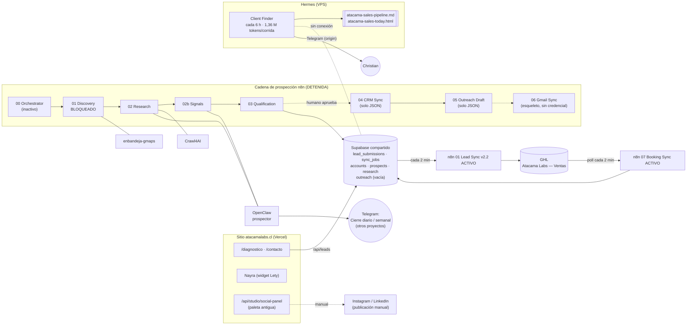
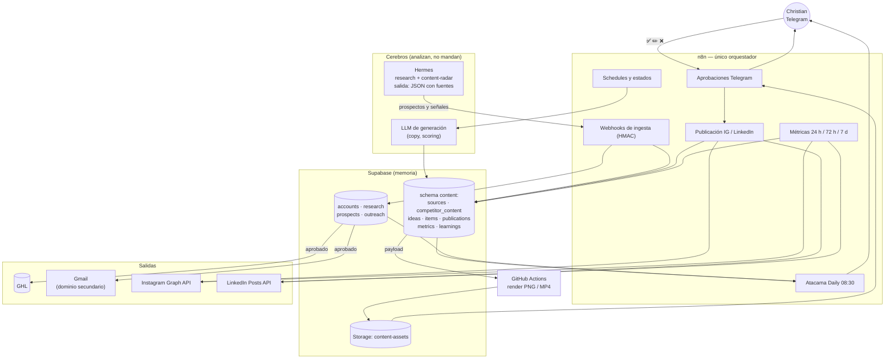

# Atacama Labs — Auditoría del sistema operativo de automatización

**Fecha de la auditoría:** 5-oct-2026 (lunes) · **Modo:** solo lectura. No se publicó, envió, activó, borró ni cambió nada.
**Fuentes revisadas:** repo `ChristianEducation/atacamalabs` (rama `main`, HEAD `2ccbf2a`), instancia n8n (API de lectura), Supabase (`uwquwjmiofixzugttals`, solo lectura), VPS (usuario `hermes-ops` con wrappers de mínimo privilegio y, para el inventario Docker, la llave de lectura existente), documentación oficial de Meta, LinkedIn y Remotion, y páginas públicas de la competencia.

> Convención de estados: **ACTIVO** (corriendo hoy) · **PROBADO** (verificado de punta a punta, pero no corre solo) · **IMPLEMENTADO** (existe el código, sin evidencia de uso reciente) · **INACTIVO** · **BLOQUEADO** · **ESPECIFICADO** (solo en documentos) · **OBSOLETO**.
> Todo lo marcado "no verificado" quedó así a propósito. Los secretos nunca se imprimieron: aquí solo aparece "configurada / no configurada".

---

## 1. Executive summary

1. **Lo que tenemos es más grande de lo que se usa.** Hay 21 workflows en n8n, 2 agentes con memoria y skills (Hermes y OpenClaw), un Supabase con un motor de prospección horizontal y un generador de piezas sociales. Solo **2 workflows corren solos** (captura de leads y sincronización de reservas) y ambos funcionan: 2.000 ejecuciones consecutivas sin un error.
2. **La prospección real hoy NO está en el sistema.** La cadena n8n → Supabase → GHL está construida y fue probada, pero está detenida (el scraper de Maps quedó bloqueado, el orquestador está inactivo, `prospects` de Atacama = 0, `outreach` = 0 filas). Mientras tanto, **Hermes** corre cada 6 horas un "Client Finder" que produce 10 prospectos por vuelta… en archivos HTML/Markdown dentro de su volumen, sin conexión con Supabase ni GHL.
3. **Hay duplicación y desperdicio.** Dos motores de prospección paralelos (n8n+OpenClaw y Hermes). Hermes gasta ~1,36 millones de tokens por ejecución (≈5,5 M/día) sobre una suscripción Codex que también usa OpenClaw (semana restante: 48 %). Hay 10 cron jobs de Hermes pausados, 9 "completados" y 11 workflows de EnBandeja (8 del motor + 3 de pruebas) inactivos que nadie ejecuta.
4. **No existe nada de contenido automatizado.** Hay un generador de paneles (`SocialCard.tsx` + `/api/studio/social-panel`), pero usa la **paleta antigua (marrón `#4E2E1E`)**, no el azul actual: sirve de esqueleto, no de producto. No hay credenciales de Instagram ni de LinkedIn en ninguna parte, ni tablas de contenido.
5. **Hallazgos de seguridad que conviene cerrar antes de automatizar más** (sección 4): 2 tablas de Supabase sin RLS (alerta crítica del propio Supabase), la interfaz de OpenClaw publicada en la IP pública (puerto 61460, responde 200 sin autenticación en la raíz), y un proceso Chromium descontrolado en OpenClaw (36 % de CPU sostenido desde el 7-sep).
6. **Recomendación de arquitectura:** *n8n manda* (programación, estados, aprobaciones, publicación, métricas), *Supabase recuerda* (fuente de verdad), *Hermes investiga* (prospectos y señales de contenido, entregando JSON estructurado y no archivos), *OpenClaw sale de la ruta crítica* (queda para asistentes personales y como biblioteca de skills de marketing) y *GHL* sigue como CRM. No se compra ninguna herramienta nueva: se usan las APIs oficiales de Instagram y LinkedIn, y el render corre en GitHub Actions, no en el VPS (que ya usa 5,0 de 7,8 GB de RAM).
7. **Camino más corto:** (a) cerrar seguridad y apagar el desperdicio; (b) conectar Hermes → Supabase para que los prospectos buenos entren al pipeline que ya existe; (c) montar el motor de contenido con aprobación por Telegram (primero imágenes y carruseles, luego reels). Detalle en las secciones 16 y 17.

---

## 2. Estado actual

### 2.1 Repositorio (`main`)

| Pieza | Qué es | Estado |
|---|---|---|
| `/src` (Next.js 16.3.5) | Sitio, landings de Rubros/Agentes, API de leads, widget de Nayra/Lety con parche iOS | **ACTIVO** (Vercel, atacamalabs.cl) |
| `/n8n` (11 JSON + README) | Familia Atacama: 00 Orchestrator, 01 Discovery, 01 Lead Sync (v1 y v2), 02 Research, 02b Signals, 03 Qualification, 04 CRM Sync, 05 Outreach Draft, 06 Gmail Sync, 07 Booking Sync | Ver 2.3: **solo 5 están desplegados**; 04/05/06 existen solo como JSON |
| `/supabase/migrations` (7) | Motor de prospección, cola `sync_jobs`, captura de leads, lock de runs, contexto de diagnóstico | **IMPLEMENTADO**; aplicado en el proyecto compartido |
| `/social` | Bios, 6 piezas C01–C06 (copy + 20 PNG exportados) | **OBSOLETO** en lo visual (paleta marrón anterior); ninguna pieza se publicó |
| `src/components/studio/SocialCard.tsx` + `src/app/api/studio/social-panel/route.tsx` | Generador de paneles con `ImageResponse`, 1080×1350, 5 tipos de panel | **IMPLEMENTADO / OBSOLETO** (colores `#4E2E1E`/`#FAF6F0`, isotipo antiguo de 5 curvas) |
| `src/lib/social-content.ts` | Copy de C01–C06 en TypeScript | **IMPLEMENTADO**, no reutilizable tal cual (es copy de lanzamiento) |
| `scripts/qa-production.mjs` + CI | QA con Playwright/axe, 1.052 comprobaciones | **ACTIVO** |
| `docs/` | Handoffs y decisiones del sitio | Sin documentación de automatización antes de este archivo |
| `atacama-labs-spec/` (carpeta hermana, fuera del repo) | Specs de arquitectura, `CONTROL-CENTER.md` (UX de aprobación: cuota 10/día, aprobación individual) y contratos de prospección | **ESPECIFICADO** (el Control Center no existe como app) |

**No encontrado:** la "llamita/alpaca oficial" no está en `public/brand` (más de 20 archivos entre logos, isotipos, favicon y avatar) ni en los dos ZIP de identidad visual (búsqueda por nombre). Tampoco existe una "guía de publicaciones" escrita. Hay que pedirle a Christian dónde está el archivo antes de generar piezas con la mascota.

### 2.2 Supabase (proyecto compartido con EnBandeja)

| Tabla | Filas | Nota |
|---|---|---|
| `accounts` | 2.711 (atacama-labs: **25**) | Entidad horizontal por `icp_pack_id` |
| `prospects` | 89 (atacama-labs: **0**) | El motor jamás calificó una cuenta real de Atacama |
| `signals` | 15 (atacama-labs: 6) | Señales de timing de las 2 cuentas procesadas |
| `research` / `contacts` | 1.002 / 210 | Casi todo de EnBandeja |
| `outreach` | **0** | Existe el esquema (gmail ids, `sent_at`, `replied_at`), jamás se usó |
| `lead_submissions` / `sync_jobs` | 3 / 3 | Formularios del sitio; la cola funciona |
| `runs` | 11 (6 completed, 2 cancelled, **3 running desde el 4-8 sep**) | 3 runs "fantasma" de otros packs |
| `icp_packs` | 7 | Además de `atacama-labs`: `casino-escolar`, `clinicas-dentales-cl` (309 cuentas, 24 prospects), `clinica-dental-piloto` (103), `centros-esteticos-cl` (52), `arriendo-eventos-cl` (88), `atacama-labs-test` |

El pack `clinicas-dentales-cl` es relevante hoy: 309 cuentas de clínicas dentales ya descubiertas. Conviene cruzarlo con la lista manual de 20 clínicas de Antofagasta antes de contactar a nadie.

### 2.3 n8n — inventario real (21 workflows, instancia `enbandeja-n8n`)

Ejecuciones leídas: las últimas 2.000 (del 4-oct 07:40 UTC al 5-oct 17:04 UTC). **Todas** pertenecen a los dos workflows con schedule activo. No se revisó el historial anterior.

| Workflow | Activo | Trigger | Qué hace | Dependencias | Estado | Riesgos |
|---|---|---|---|---|---|---|
| **Atacama Labs - 01 Lead Sync v2.2** (`idniXY0Du2qet57O`) | Sí | Cada 2 min | Reclama jobs de `sync_jobs`, crea contacto + oportunidad + nota en GHL (atribución UTM incluida) | Supabase, GHL (token propio) | **ACTIVO**, 1.001/1.001 OK | Polling constante (720 ejecuciones/día) para un volumen de ~3 leads totales; ver 4.4 |
| **Atacama Labs - 07 Booking Sync** (`sw0xbhB91s5mhHCh`) | Sí | Cada 2 min | Lee reservas del calendario GHL y mueve la oportunidad a "Diagnóstico" | GHL Calendars, Supabase | **ACTIVO**, 999/999 OK | Mismo polling; GHL no ofrece webhooks para Private Integrations; horas en UTC (ajuste manual en abril 2027) |
| Atacama Labs — 00 Orchestrator (`ubXANtYTd5y9wdbP`) | No | Manual / sub-workflow | Encadena 01→02→02b→03 con lock atómico y checkpoints | Los 4 sub-workflows PROD | **PROBADO** (16-sep), **INACTIVO** | Se detiene a propósito antes de 04/05; sin schedule |
| Atacama Labs — 01 Discovery (PROD) (`AnjrmngEzXWiXIVT`) | Sí* | Solo invocado | Busca empresas en Google Maps por área | `enbandeja-gmaps` (scraper compartido) | **BLOQUEADO**: los jobs del scraper quedaron `pending` en 4 intentos | Depende de un servicio compartido con EnBandeja |
| Atacama Labs — 02 Research (PROD) (`cw3oTblethuiTtEm`) | Sí* | Solo invocado | Investiga cada cuenta (Crawl4AI + OpenClaw `prospector`) y guarda evidencia | Crawl4AI, OpenClaw, Supabase | **PROBADO** | Usa credenciales compartidas de EnBandeja (pendiente U17); ~7 min por empresa |
| Atacama Labs — 02b Signals (PROD) (`liNLmszWOlEz9kVv`) | Sí* | Solo invocado | Busca señales de timing (contratación, expansión, noticias) | OpenClaw | **PROBADO** | Mismo ritmo lento; cohorte de 25 se cortó en 2/25 |
| Atacama Labs — 03 Qualification (PROD) (`LzkojauO5ypKNALc`) | Sí* | Solo invocado | Puntaje 0-100 por 7 factores, clase A/B/C, gates | Supabase | **PROBADO** (score 83, hot, con datos ficticios) | Nunca calificó una cuenta real |
| Atacama Labs - 01 Lead Sync (v1, v2, v2.1) (`oKQujZqHy09dMJao`, `COWM3i2F4VZq7Dau`, `dlB8WgFwQZjtDJz1`) | No | (schedule apagado) | Versiones anteriores del sync | — | **OBSOLETO** (respaldo de rollback) | Basura acumulada; v1/v2/v2.1 pueden borrarse cuando se confirme que v2.2 es estable |
| 00 - Daily Prospecting Orchestrator V1 (`DE01MGCEtThtDrQc`) | No | Cron `0 6 * * *` (apagado) | Orquestador de EnBandeja | Supabase | **INACTIVO** | Si alguien lo activa corre contra `casino-escolar` |
| 01 - Discovery Engine / v3 GEO (`k6rogjW0XHcwulJ4`, `TWyJBIBUW4az9XJy`), 01b Import Closed Universe (`dxWSn9xNawcCgiDS`) | No | Manual | Descubrimiento EnBandeja | — | **INACTIVO** (v1 duplicado de v3) | Duplicados |
| 02 - Research Engine FINAL (`XudNFS0CNx3SeGtb`), 02b Signals (`q4zOm2QckejUodh2`), 03 Qualification V1 (`KFFgb15g1tgN1kTl`), 04 GHL Intake V1.2 (`OgUFj7JVv5JOXWUT`) | No | Manual / sub-workflow | Motor de EnBandeja (fuente de los clones de Atacama) | Supabase, OpenClaw, GHL | **INACTIVO** (referencia, no tocar) | Marcados "solo lectura" por protocolo |
| BENCHMARK Exa+GPT, BENCHMARK Oxylabs+GPT, TEST Direct Model (`XT9FyAEGOjwgjyie`, `9w30pRzZagis6Us6`, `IDDoxJy4iHZjpmKN`) | No | Manual | Pruebas de triage de agosto | Exa, Oxylabs | **OBSOLETO** | Credenciales de terceros colgando |
| *No desplegados:* Atacama 04 CRM Sync, 05 Outreach Draft, 06 Gmail Sync, 01 Discovery/02/02b/03 en modo `test` | — | — | Solo existen como JSON en el repo (se probaron como copias desechables y se borraron) | — | **IMPLEMENTADO** (04/05 probados; 06 es esqueleto) | **No hay nada que cree borradores ni sincronice prospectos hoy** |

\* "Sí" porque están activados para poder ser invocados por el orquestador; no tienen schedule.

**Credenciales n8n en uso** (nombres, no valores): `Atacama Labs - Supabase`, `Atacama Labs - GHL Header Auth`, `Atacama Labs - GHL Calendars Auth` (propias), y `Header Auth account` / `Header Auth account 2` (compartidas con EnBandeja: OpenClaw y Crawl4AI). **No hay credencial de Gmail, Instagram, LinkedIn ni Telegram.**

### 2.4 Servidor (VPS Hostinger KVM 2: 2 vCPU, 8 GB RAM, 96 GB de disco)

Uso al momento: RAM 5,0 GB usados / 2,8 GB disponibles; disco 59 %.

| Contenedor | Estado | Puerto publicado | Función |
|---|---|---|---|
| `enbandeja-n8n` | Up 7 semanas | 5678 interno (Traefik) | Orquestador |
| `openclaw-655m-openclaw-1` + `gateway-proxy-1` | Up 4 semanas | **0.0.0.0:61460** | OpenClaw (2,3 GB RAM, ~50 % CPU) |
| `hermes-workspace-ejof-hermes-agent-1` + `hermes-workspace-1` | Up 6 semanas | 0.0.0.0:32776 (no respondió desde fuera) | Hermes |
| `crawl4ai-stii-crawl4ai-1` | Up 7 semanas | 0.0.0.0:32774 (responde 401) | Scraper web |
| `enbandeja-gmaps` | Up 3 semanas | 127.0.0.1:8080 | Scraper de Google Maps |
| `traefik-traefik-1` | Up 5 meses | 80/443 | Proxy HTTPS |

### 2.5 OpenClaw (v2026.7.1-2)

- **6 agentes:** `main` (JARVIS), `cody`, `sanluis` (Luchito), `familia` (Yoyo) — personales/otros proyectos — y los dos que usa el negocio: `prospector` y `enbandeja-triage` (ambos `openai/gpt-5.5`).
- **3 cron jobs:** "Cierre Operativo Diario" (lun-sáb 21:30 → Telegram), "Memory Dreaming" (03:00) y "Revisión Semanal" (domingos). Ninguno es de Atacama Labs.
- **Canal:** 4 bots de Telegram (polling). **Sin canal de Instagram, LinkedIn ni correo.**
- **Skills:** 109, de las cuales 72 listas; incluye un paquete de marketing (ab-testing, ad-creative, ads, ai-seo, cro, copywriting…) que sirve como biblioteca de prompts para copy.
- **Modelos:** por defecto `openai/gpt-5.5` (OAuth Codex) con 5 respaldos gratuitos en OpenRouter; cuota Codex al momento: ventana de 5 h 95 % libre, semana **48 % libre** (reinicia en ~4 días).
- **Problemas:** proceso `chromium --type=gpu-process` vivo desde el 7-sep con 14.680 minutos de CPU acumulados (~36 % de un núcleo, sostenido). Claves de proveedores guardadas en texto plano dentro de `models.json` (el comando `openclaw models status` imprime sus primeros/últimos caracteres).

### 2.6 Hermes (v0.20.4+)

- **Modelo:** `gpt-5.6-luna` vía suscripción Codex (OAuth, token refrescado hoy 15:25 UTC); respaldo OpenRouter.
- **Interfaces:** Telegram con canal "home" configurado y allowlist; Workspace web. No tiene herramienta para **enviar** mensajes a terceros (por diseño verificado en Category D).
- **20 cron jobs:** **1 programado** (`Atacama Labs — Client Finder`, cada 360 min, 4 corridas/día), **9 completados** (investigaciones puntuales de agosto/septiembre), **10 pausados** (incluidos los tres de la baseline V2: `hermes-health-watch`, `daily-personal-radar`, `weekly-chief-of-staff-review`, y varios "Outbound Loop", "Pain Signals", "Antofagasta Google Maps 50").
- **Client Finder:** prompt de adquisición de clientes con skills `opportunity-builder` + `grounded-citations`; máximo 10 prospectos nuevos por corrida; escribe `atacama-sales-pipeline.md` (174 líneas, última edición hoy 15:38 UTC) y `atacama-sales-today.html`, deduplicando contra 3 HTML anteriores. Última corrida: **1.359.289 tokens de entrada, 890 s**. **No escribe en Supabase ni GHL.**
- **Skills propias:** `opportunity-builder`, `personal-agent-radar`; ~80 skills incluidas (creativas: `humanizer`, `manim-video`, `ascii-video`, `excalidraw`, `architecture-diagram`, `baoyu-infographic`, `claude-design`…). Sin keys de Firecrawl, Tavily, GitHub, FAL ni ElevenLabs.

### 2.7 CRM, correo y redes

| Pieza | Estado |
|---|---|
| **GHL** pipeline "Atacama Labs — Ventas", calendario "Reunión de activación", campos personalizados | **ACTIVO** (Lead Sync y Booking Sync lo alimentan) |
| **Gmail / Google Workspace** | **No hay credencial.** El workflow 06 es un esqueleto que lanza error a propósito. El conector de Gmail de Claude está desconectado. |
| **Instagram** `@atacama.labs` | Cuenta existente; publicaciones manuales. **Sin app de Meta, sin token.** No verificado si es cuenta Profesional ni si tiene página de Facebook vinculada. |
| **LinkedIn** (empresa y personal) | Sin credenciales. En `social/README.md` la página de empresa figura "pendiente de crear". No verificado si existe hoy. |
| **Telegram** | Existen 2 bots operativos (OpenClaw y Hermes). Ninguno es del sistema de contenido. |

---

## 3. Arquitectura actual



Lectura rápida: el único flujo continuo es *formulario → GHL → reunión*. La prospección y el contenido son dos islas.

---

## 4. Problemas actuales

### 4.1 Seguridad (documentar primero, según tu instrucción)

| # | Hallazgo | Gravedad | Evidencia | Acción sugerida (no aplicada) |
|---|---|---|---|---|
| S1 | `public.runs` y `public._backup_prospects_pre_operator_required_20260903` **sin Row Level Security** | **Alta** (alerta crítica del propio Supabase) | `list_tables` → `rls_enabled:false`; con la clave anónima cualquiera puede leerlas/modificarlas. La tabla `_backup_prospects…` guarda 62 filas de prospectos | `ALTER TABLE … ENABLE ROW LEVEL SECURITY;` en ambas (n8n usa service_role y no se ve afectado) y borrar el respaldo cuando ya no haga falta. **Requiere tu OK.** |
| S2 | Interfaz de OpenClaw publicada en `0.0.0.0:61460` por HTTP | **Alta (a verificar)** | `GET /` desde internet responde 200 con la página "OpenClaw". No se probó nada más allá de la raíz. El gateway tiene token, pero la UI no debería estar abierta al mundo | Ligar el puerto a `127.0.0.1` (o firewall/Tailscale). Cambio en el compose de OpenClaw, fuera del alcance de esta auditoría |
| S3 | Crawl4AI en `0.0.0.0:32774` | Media | Responde 401 (tiene autenticación) | Idem: cerrar al exterior si solo lo usa n8n por red interna |
| S4 | Proceso Chromium descontrolado en OpenClaw (14.680 min de CPU) | Media (operativo, afecta a todo el VPS de 2 vCPU) | `ps` dentro del contenedor | Reiniciar el contenedor en una ventana tranquila (recuerda reiniciar `gateway-proxy` justo después) |
| S5 | Claves de terceros en texto plano (`models.json` de OpenClaw; `.env.local` local de la app tiene `service_role`, tokens GHL y la API key de n8n) | Media | `.env*` está en `.gitignore` (verificado); `models status` imprime previews parciales | No imprimir nunca ese comando en logs compartidos; rotar al terminar el proyecto |
| S6 | Brecha ya documentada en Hermes: su navegador puede publicar/comprar sin barrera técnica | Media | `CURRENT_STATE.md` de `hermes-ops` | Mantener a Hermes **sin** credenciales de Instagram/LinkedIn/Gmail. Que publique solo n8n |
| S7 | Un solo Supabase y un solo n8n compartidos entre EnBandeja y Atacama | Media | Incidente del 15-sep (se tocaron 2 cuentas reales de EnBandeja) | Esquema propio `content` + RLS desde el día 1; protocolo de pruebas con copias desechables ya existente |
| S8 | Credenciales compartidas con EnBandeja (OpenClaw y Crawl4AI en 02/02b) | Baja | Pendiente U17 | Crear credenciales propias de Atacama |

### 4.2 Duplicación

- **Dos motores de prospección:** n8n+OpenClaw (estructurado, lento, detenido) y Hermes (rápido, útil, desconectado). Resultado: 0 prospectos de Atacama en la base y 174 líneas de prospectos en un archivo que nadie importa.
- **Tres generaciones de crons de prospección en Hermes** (Outbound Loop → Misión 2 → Client Finder), más "Pain Signals", "Client Acquisition" y "Antofagasta Maps 50", casi todos pausados.
- **Cuatro versiones del Lead Sync** (una activa, tres de respaldo) y **11 workflows de EnBandeja inactivos** (8 del motor y 3 de benchmark) que se mezclan en la misma lista.
- **Dos "chiefs of staff":** el `personal-agent-radar` de Hermes (pausado) y el "Cierre Operativo Diario" de OpenClaw (activo), ambos por Telegram, ninguno de Atacama.

### 4.3 Deuda y huecos

- Nada convierte un prospecto de Hermes en una fila de `accounts`/`research`/`prospects`.
- No hay canal de envío (Gmail), ni de respuestas, ni de baja (unsubscribe).
- Sin alertas: si un job de `sync_jobs` llega a `failed`, solo se ve consultando la tabla.
- Control Center (UX de aprobación) especificado pero sin construir; la aprobación humana de prospectos es manual en SQL/GHL.
- 3 runs de otros packs "running" desde septiembre bloquean el lock de esos packs (`runs_one_active_per_pack`). No afectan a `atacama-labs`, pero ensucian el panel.
- Generador social con la identidad anterior y sin la mascota oficial en el repo.

### 4.4 Costo y capacidad

- **Cuota Codex compartida** (Hermes y OpenClaw usan OAuth de ChatGPT/Codex; no verificado que sea la misma cuenta, pero OpenClaw muestra `c.wevarh@gmail.com`). Hermes consume ~5,5 M tokens/día en Client Finder; OpenClaw ya va en 48 % semanal. Si se agota, se caen los dos a la vez.
- **n8n:** 1.440 ejecuciones diarias de polling para ~3 leads en total. No es un costo en dinero pero llena el historial y esconde errores reales.
- **VPS:** 2,8 GB libres. Sumar render de video o Chromium de scraping extra es arriesgado.

---

## 5. Qué podemos reutilizar

| Activo | Para qué sirve en la nueva arquitectura |
|---|---|
| **n8n + Supabase + GHL** (ya conectados, con credenciales propias de Atacama) | Columna vertebral del sistema; nada que migrar |
| **`sync_jobs` / `claim_sync_jobs` / `complete_sync_job`** | Patrón de cola con `effect_key` único (idempotencia), backoff 1/5/15/60 min y claims atómicos con `SKIP LOCKED`. Se copia el patrón para `publication_jobs` |
| **`runs` + índice `runs_one_active_per_pack`** | Patrón de lock atómico anti-superposición |
| **03 Qualification** (7 factores, gates A/B/C, `human_review_required`) | Calificación de prospectos tal cual |
| **05 Outreach Draft** (solo borradores, exige citar evidencia con URL) | Redacción de correos con la regla "sin evidencia no se escribe" |
| **07 Booking Sync** | Cierra el ciclo correo → reunión; ya funciona |
| **Skills de Hermes** `opportunity-builder` y `grounded-citations` + prompt del Client Finder | Investigación de prospectos con evidencia citada; base del carril de contenido ("content-radar") |
| **Hermes: `humanizer`, `excalidraw`, `architecture-diagram`** | Pulido de copy y diagramas para piezas |
| **Skills de marketing de OpenClaw** (copywriting, ai-seo, ab-testing…) | Biblioteca de prompts; se copian a una skill de Hermes o a prompts de n8n, sin depender del runtime de OpenClaw |
| **Pack Supabase `clinicas-dentales-cl`** (309 cuentas) | Cruce inmediato con la lista manual de clínicas de Antofagasta |
| **`SocialCard.tsx` + `ImageResponse`** | Estructura de "JSON → PNG"; hay que re-tematizar con los tokens actuales (`--blue #0f5ced`, `--paper #fbf8f2`, `--ink #121a2b`; confirmar si el azul oscuro `#041228` es un token vigente) y leer los SVG de `public/brand/` en vez de pegar paths |
| **Pipeline de piezas de Instagram hecho a mano** (HTML + Playwright + ffmpeg: carrusel, video "¿Chatbot o agente?", pixel-art) | Prueba de concepto de render de reels. Hoy vive en el scratchpad de una sesión, no en el repo; hay que moverlo a `social/engine/` |
| **Telegram** (bots existentes) | Canal de aprobación; se crea un bot nuevo para el sistema de contenido |
| **Landings de Rubros/Agentes** (`industries.ts`, `agents.ts`, FAQ por rubro) | Fuente de verdad de contenido evergreen (dolores, preguntas, casos por rubro) |
| **GitHub + Actions** | Render de imágenes/videos fuera del VPS |

---

## 6. Arquitectura objetivo



Principios: (1) un solo lugar donde se programa cada responsabilidad; (2) los agentes **entregan datos estructurados**, nunca archivos sueltos; (3) todo lo que sale al mundo (correo, publicación) lo ejecuta n8n, después de una aprobación registrada; (4) cada paso es idempotente y deja huella en Supabase.

---

## 7. Responsabilidades

| Componente | Responsabilidad | Lo que NO hace |
|---|---|---|
| **n8n** | Orquestación: schedules, máquina de estados, retries, aprobaciones por Telegram, publicación en Instagram/LinkedIn, envío de correo aprobado, lectura de métricas, Atacama Daily, alertas | No "piensa" con prompts largos; no investiga |
| **Supabase** | Fuente de verdad y memoria: prospectos, evidencia, ideas, piezas, publicaciones, métricas, aprendizajes, auditoría de aprobaciones | No ejecuta lógica de negocio fuera de RPCs de cola y locks |
| **Hermes** | Investigación: (a) prospectos con evidencia citada, (b) señales de contenido (noticias, competencia, preguntas recurrentes) en formato JSON; skills reutilizables; análisis semanal de qué rindió | No publica, no envía, no tiene credenciales de redes ni de Gmail; no es dueño de ningún schedule de negocio salvo su tarea de investigación (ver 7.1) |
| **OpenClaw** | Fuera de la ruta crítica. Mantiene sus asistentes personales (JARVIS, Cody, etc.) y sirve como biblioteca de skills de marketing. 02/02b de n8n lo seguirán usando mientras no se reemplacen | No recibe tareas nuevas de Atacama; su UI deja de estar pública |
| **GHL** | CRM y calendario: contacto, oportunidad, etapas, notas, reuniones | No decide a quién escribir |
| **Gmail** | Canal de salida de correos aprobados (casilla en dominio secundario para frío; alias oficial solo para respuestas a personas que ya escribieron) | No es CRM |
| **Web (Vercel)** | Fuente de contenido evergreen, destino de los CTA con UTM, y host de `/api/studio/*` si se mantiene el render ahí | No almacena estado de automatización |
| **GitHub Actions** | Render reproducible de imágenes y videos, sin cargar el VPS | No decide qué se publica |
| **Claude Code** | Construye y mantiene los workflows y el código; revisa PRs | No corre en producción |

### 7.1 Sobre "un solo orquestador" y Hermes

Lo ideal es que n8n dispare también la investigación de Hermes. Hoy Hermes tiene su propio cron y su API de Workspace; no se verificó que se pueda invocar una skill desde n8n de forma estable. Recomendación: en la Fase 1 hacer un *spike* de dos días con dos opciones — (A) n8n llama a la API del Workspace de Hermes; (B) Hermes sigue con su cron **solo para investigación**, entrega a un webhook de n8n y n8n vigila con un "watchdog" (si no llegó la corrida de hoy, alerta). Se elige A si funciona; B es aceptable: sigue habiendo un solo orquestador para todo lo que toca el mundo exterior.

---

## 8. Sistema de contenido

Resumen (diseño completo en [`CONTENT-AUTOMATION-SPEC.md`](CONTENT-AUTOMATION-SPEC.md) y [`ATACAMA-CONTENT-ENGINE-V1.md`](ATACAMA-CONTENT-ENGINE-V1.md)):

1. **Entradas:** (a) investigación de Hermes (noticias, preguntas recurrentes, competencia), (b) competencia vía Instagram *Business Discovery* y páginas públicas, (c) trabajo real de Atacama (commits, workflows, casos anonimizados, que alimenta un formulario de 1 minuto por Telegram), (d) banco evergreen derivado de las landings.
2. **Ideas + scoring** con la rúbrica de 9 criterios (puntaje 0-100, umbral 70, regla "nunca inventar una noticia").
3. **Selección diaria:** 1 idea ganadora + 2 suplentes; si ninguna llega a 70, entra la mejor del banco evergreen.
4. **Generación:** el modelo decide formato y produce un JSON estructurado (hook, slides, caption por plataforma, CTA con UTM, fuentes); el código garantiza la identidad visual.
5. **Aprobación por Telegram** con vista previa, fuente y razón; ✅ / ✏️ / ❌.
6. **Publicación** por API oficial; guarda `post_id`.
7. **Métricas** a las 24 h, 72 h y 7 días; el sistema escribe aprendizajes que realimentan el scoring.

---

## 9. Competitor intelligence

- **Fuente oficial para Instagram:** la API *Business Discovery* devuelve, de cualquier cuenta profesional pública, `followers_count`, `media_count` y, por publicación, `like_count`, `comments_count` y `view_count` (incluye pagadas), sin guardar nada ajeno que no sea público. Requiere el mismo token de Atacama una vez creada la app de Meta. No cubre stories ni cuentas personales.
- **LinkedIn:** no existe API oficial para leer publicaciones de otras páginas. Se resuelve con curación semiautomática: comando `/competidor <url>` por Telegram que guarda enlace + nota, y revisión semanal de 10-15 minutos.
- **Web/blogs/newsletters:** lectura pública de blogs, changelogs y prensa (se hizo hoy; ver [`COMPETITOR-CONTENT-RESEARCH.md`](COMPETITOR-CONTENT-RESEARCH.md)).
- **Qué se guarda:** empresa, plataforma, formato, tema, hook, CTA, fecha, URL, métrica pública y *por qué podría ser relevante para Atacama*. Nunca el texto completo de terceros.
- **Límite honesto de hoy:** Instagram y LinkedIn no se pueden leer sin sesión; no se usó la sesión del navegador de Christian para evitar riesgo de bloqueo. La muestra incluida es de blogs y sitios públicos. La cuenta "Eclectica" **no se pudo verificar** (ver investigación).

---

## 10. Generación de contenido

| Formato | Motor | Cuándo |
|---|---|---|
| **Imagen / carrusel** | Plantillas React renderizadas a PNG/JPEG (Instagram solo acepta JPEG), 1080×1350. Reutiliza `SocialCard` re-tematizada; el modelo entrega JSON y no HTML | Explicaciones, listas, comparaciones, casos |
| **Reel / video corto** | **Remotion** (React → MP4, determinista por frame) renderizado en GitHub Actions; subtítulos incrustados; sin voz al inicio | Demos, procesos, noticia rápida |
| **Documento LinkedIn** | PDF de las mismas slides (la API oficial admite documentos orgánicos de hasta 100 MB y 300 páginas) | Explicaciones largas, opinión con soporte |
| **Post de texto** | Solo texto | Opinión, noticia con postura |
| **Pixel-art / animación** | Grabación de páginas reales del sitio con Playwright → ffmpeg (técnica ya probada) | Demos de producto |

Remotion es gratis para empresas de hasta 3 personas (según su página de precios; confirmar la licencia vigente antes de producción). Alternativa si se prefiere cero dependencias: Playwright `recordVideo` + ffmpeg, que ya usamos, a costa de menor precisión de cuadros. TTS y música: fuera de la v1.

---

## 11. Publishing

| Plataforma | Capacidad | Estado | Requisitos |
|---|---|---|---|
| **Instagram: imagen, carrusel (hasta 10), Reels, Stories** | Contenedor `/media` → `/media_publish`; límite oficial **100 publicaciones por API en 24 h** (el carrusel cuenta como 1); solo JPEG; el video debe estar en una URL pública | **Posible vía API oficial** | Cuenta Profesional vinculada a página de Facebook; app de Meta tipo Business; permisos `instagram_business_basic` + `instagram_business_content_publish` (login de Instagram) o `instagram_basic` + `instagram_content_publish` + `pages_read_engagement` (login de Facebook); token de 60 días a renovar |
| **Instagram: programación nativa** | No existe; la agenda la lleva n8n | — | — |
| **Instagram: insights** | Alcance, interacciones, guardados, etc. por publicación | **Posible**, nombres de métricas por confirmar (la página de referencia consultada hoy devolvió 404) | `instagram_business_manage_insights` |
| **Comentarios → DM** (palabra clave) | Respuesta privada a comentarios, un mensaje por comentarista | **Posible**, reglas exactas (ventana de 7 días, límites) por confirmar contra la documentación de Private Replies | `manage_comments` + `manage_messages`; fuera de la v1 |
| **LinkedIn: texto, imagen, video, documento (PDF), multiimagen, artículo, encuesta** | `POST /rest/posts` con cabecera `Linkedin-Version: YYYYMM`; imágenes/videos/documentos se suben antes y se referencia el URN | **Posible vía API oficial** | `w_organization_social` y rol de administrador en la página; requiere aprobación del *Community Management API* (nivel Development → Standard; un tercero estima 1-2 semanas, sin confirmar) |
| **LinkedIn: "carrusel" orgánico nativo** | **No soportado** (solo patrocinado). El equivalente orgánico es un **documento PDF** | Workaround oficial: PDF | Un artículo de terceros afirma que subir documentos no está soportado; la documentación oficial de Microsoft sí lo describe para posts orgánicos. **Validar en el spike** |
| **LinkedIn: perfil personal de Christian** | Mismo endpoint con `w_member_social` | Posible; es el plan B mientras se aprueba la página | Producto "Share on LinkedIn" |
| **Automatización por navegador/scraping para publicar** | — | **No recomendable** y no hace falta | — |

Aviso de versión: la versión 202510 de las APIs de marketing de LinkedIn se retira el **15-oct-2026**; usar una versión vigente (p. ej. 202609).

---

## 12. Analytics loop

- **Recolección:** n8n consulta insights a +24 h, +72 h, +7 d; guarda una fila por consulta (`publication_metrics`), nunca sobrescribe.
- **Atribución a negocio:** todos los CTA llevan UTM (`utm_source=instagram|linkedin`, `utm_campaign=<content_id>`); la nota de GHL ya muestra Canal/Campaña/Contenido/Landing (commit `db6851e`), así que **leads y reuniones se pueden atribuir a una pieza concreta sin tocar el sitio**.
- **Aprendizaje:** cada semana el sistema agrega por formato/tema/hook/hora y escribe `content_learnings` con evidencia ("Los carruseles educativos promedian X guardados vs Y de los reels", solo si n ≥ 5 por grupo). El scoring de ideas usa esos aprendizajes como un criterio con peso acotado (±10 pts) para no caer en un círculo vicioso de copiar lo que ya funcionó.
- **Revisión humana mensual** de los aprendizajes antes de que cambien la cadencia.

---

## 13. Prospección

**Estado real:**

| Etapa | Qué existe | Estado |
|---|---|---|
| Discovery | Google Maps por áreas (Antofagasta, Calama, Mejillones, Tocopilla) | **BLOQUEADO** (scraper compartido) |
| Research | Crawl4AI + OpenClaw `prospector`; 7 factores con evidencia | **PROBADO**, lento (~7 min por empresa) |
| Signals | OpenClaw busca señales de timing | **PROBADO** |
| Qualification | Puntaje + gates A/B/C, revisión humana obligatoria | **PROBADO** (con datos ficticios) |
| CRM Sync | Solo `ready_to_contact` aprobado por humano | **IMPLEMENTADO** (solo JSON) |
| Outreach Draft | Solo borradores con evidencia citada | **IMPLEMENTADO** (solo JSON) |
| Envío | Ninguno | **No existe** |
| Respuestas / baja | 06 Gmail Sync (esqueleto) | **BLOQUEADO** (sin credencial) |
| Reunión | 07 Booking Sync | **ACTIVO** |
| Hermes Client Finder | 10 prospectos por corrida con oferta, mensaje y precio sugerido | **ACTIVO pero aislado** |

**Brechas para "hasta 20 correos realmente buenos al día":**
1. Ingesta Hermes → Supabase (hoy es copiar y pegar mental).
2. Una puerta de calidad *antes* de enviar a calificación: empresa verificada + dolor con URL + contacto publicado + razón específica; si no, se descarta (no se rellena).
3. Casilla y dominio de envío (secundario, SPF/DKIM/DMARC, calentamiento de 4-6 semanas, tope seguro 30-50 por casilla al día) y baja de un clic.
4. Aprobación individual por Telegram/Control Center (ya especificada: cuota 10/día en el spec original; se sube a 20 con la regla "solo los que pasan el gate").
5. Lectura de respuestas (06) y cierre en GHL.

**Regla de oro (ya en el diseño):** si hoy aparecen 7 prospectos buenos, se envían 7.

---

## 14. Atacama Daily

Briefing diario a las 08:30 (America/Santiago) por Telegram, generado por **n8n** con consultas deterministas y **un solo párrafo** escrito por LLM ("qué importa hoy"). Hermes y OpenClaw solo aportan datos; no generan el informe, para que no se caiga si un agente se cae.

```
ATACAMA DAILY · lun 5-oct
VENTAS    leads nuevos 0 · prospectos nuevos 7 · calificados 3 · borradores 3 · respuestas 1 · reuniones hoy 1
CONTENIDO hoy: Carrusel "Agente vs chatbot" (esperando tu OK) · próximas 48 h: 2 · tendencia: …
OPERACIÓN workflows fallidos 24 h: 0 · cola sync: 0 · Hermes: corrió 05:30 ✓ · cuota Codex semanal: 48 % · VPS RAM 64 %
HOY NECESITAS  3 correos para aprobar · 1 publicación · 0 propuestas
```

Fuentes: Supabase (conteos), API de n8n (ejecuciones fallidas), GHL (reuniones del día), endpoint de salud de Hermes/OpenClaw (por definir en Fase 1), tabla de cuotas. La parte "operación" es la que hoy no existe y habría detectado el chromium descontrolado.

---

## 15. Gap analysis

| Necesidad | Existe | Estado | Falta | Prioridad |
|---|---|---|---|---|
| Captura de leads → CRM | Sí | ACTIVO | Alerta si un job falla 4 veces; bajar polling | Baja |
| Reservas → CRM | Sí | ACTIVO | — | — |
| Descubrir prospectos | Hermes + n8n Discovery | Hermes ACTIVO / n8n BLOQUEADO | Ingesta a Supabase; decidir fuente única | **Alta** |
| Calificar prospectos | 03 Qualification | PROBADO | Correrlo con cuentas reales; gate de calidad previo | **Alta** |
| Aprobación humana | Spec Control Center | ESPECIFICADO | Botones por Telegram | **Alta** |
| Borradores de correo | 05 Outreach Draft | IMPLEMENTADO (JSON) | Desplegarlo (copia segura) | Alta |
| Enviar correos | — | No existe | Dominio secundario, casilla, nodo Gmail, baja | **Alta** |
| Respuestas / seguimiento | 06 | BLOQUEADO | Credencial Gmail | Media |
| Investigación de contenido | — | No existe | Skill `content-radar` + webhook | **Alta** |
| Banco evergreen + ideas + scoring | — | No existe | Tablas, rúbrica, 30 ideas semilla | **Alta** |
| Generar carruseles | `SocialCard` | OBSOLETO (paleta) | Re-tematizar + render en Actions | **Alta** |
| Generar reels | Prueba manual (scratchpad) | PROBADO a mano | Remotion + plantillas + CI | Media |
| Publicar Instagram | — | No existe | App Meta, token, workflow | **Alta** |
| Publicar LinkedIn | — | No existe | Página, solicitud de API, workflow | Media |
| Métricas y aprendizaje | — | No existe | Tablas + workflow 24 h/72 h/7 d | Media |
| Competitor monitoring | — | No existe | Business Discovery + comando `/competidor` | Media |
| Atacama Daily | — | No existe | Workflow n8n + health endpoints | Media |
| Observabilidad | Parcial (`runs`) | — | Workflow de error global, tabla `ops_events` | Media |
| Seguridad (S1-S8) | — | Abiertos | Aplicar acciones de 4.1 | **Alta** |
| Mascota/guía de publicaciones | No encontrada | — | Ubicación del archivo | Baja |
| Dominio/cuentas legales | Pendiente | — | Razón social, RUT en `/privacidad` | Media (requisito para envío en frío) |

---

## 16. Roadmap

### Fase 0 — Seguridad y limpieza (1-2 días)
- Habilitar RLS en `runs` y `_backup_prospects…` (con tu OK) y cerrar `runs` zombi.
- Cerrar al exterior el puerto de OpenClaw (y Crawl4AI si solo es interno); reiniciar OpenClaw para matar el Chromium.
- Bajar Client Finder a 1 corrida diaria y modelo barato para el barrido (antes había corridas de ~120 k tokens con Gemini Flash).
- Cambiar polling de Lead Sync/Booking Sync de 2 a 5 minutos. Archivar (no borrar) Lead Sync v1/v2/v2.1.
- Crear credenciales propias de Atacama para OpenClaw/Crawl4AI (U17).

### Fase 1 — MVP operativo de prospección (1 semana)
- *Spike* de integración Hermes ↔ n8n (6.1).
- Webhook de ingesta con firma HMAC + puerta de calidad; Hermes escribe a `accounts/research`.
- Desplegar 04 y 05 como copias seguras; aprobación por Telegram.
- Dominio secundario + casilla + calentamiento; Gmail con aprobación individual; primer lote de 5-10 envíos (las clínicas de Antofagasta, ya preparadas a mano).
- Atacama Daily v0 (ventas + operación).

### Fase 2 — Contenido diario (2-3 semanas)
- Crear app de Meta + token; pedir Community Management API de LinkedIn el día 1 (la espera es larga) y usar el perfil personal mientras tanto.
- Esquema `content`, rúbrica, 30 ideas evergreen, `content-radar` de Hermes.
- Re-tematizar plantillas, render en GitHub Actions, aprobación por Telegram, publicación de imágenes/carruseles. Cadencia inicial: 3-4 piezas por semana.
- Agregar Reels con Remotion al final de la fase.

### Fase 3 — Analytics y aprendizaje (2 semanas)
- Métricas 24 h/72 h/7 d, UTM → GHL, `content_learnings`, comando `/competidor`, Business Discovery semanal.
- Subir a 7 piezas por semana si el gate no genera descartes forzados.

### Fase 4 — Mayor autonomía (después de ≥ 4 semanas de datos)
- Autopublicación de evergreen con aprobación previa de la plantilla, puntaje ≥ 85 y tasa de edición < 10 % en las últimas 10 piezas.
- Comentario → DM con captura de leads en GHL.
- Evaluar si Hermes pasa a ser invocado por n8n (opción A) o si se mantiene el patrón B.

---

## 17. Quick wins (poco trabajo, mucho efecto)

1. **Cerrar el puerto 61460 y reiniciar OpenClaw** — arregla seguridad y libera CPU.
2. **RLS en 2 tablas** — dos sentencias SQL.
3. **Bajar Client Finder a 1×/día** — recupera cuota Codex para el resto.
4. **Pegar el CSV/MD de Hermes a Supabase una vez** (script de importación) para ver si el gate de calificación sirve antes de automatizar la ingesta.
5. **Cruzar las 20 clínicas de Antofagasta con el pack `clinicas-dentales-cl`** (309 cuentas): evita contactar dos veces y puede traer correos públicos que faltan.
6. **Crear el bot de Telegram del sistema** (2 minutos en BotFather) — desbloquea las aprobaciones.
7. **Mover el pipeline de render que hicimos a mano a `social/engine/`** — convierte una prueba de concepto en un activo versionado.
8. **Pedir hoy la aprobación del API de LinkedIn** — la espera corre sola.

---

## 18. Decisiones que necesita Christian

1. **¿Hermes como investigador oficial de prospectos y contenido, y OpenClaw fuera de la ruta crítica?** (recomendado). Alternativa: A/B de 10 cuentas con ambos antes de decidir.
2. **¿Autorizas cerrar los puertos públicos y habilitar RLS?** (S1, S2). Son cambios acotados, pero tocan servicios compartidos.
3. **Instagram:** ¿`@atacama.labs` es cuenta Profesional y está vinculada a una página de Facebook? Si no, hay que convertirla. Crear la app de Meta toma ~30 min contigo.
4. **LinkedIn:** ¿existe la página de empresa? ¿Quién es administrador? Se necesita para solicitar la API.
5. **Proveedor y presupuesto del LLM de generación:** seguir con la suscripción Codex (cuota compartida, ya al 48 %) o una clave de OpenRouter/Anthropic con tope mensual (estimado < US$10 al mes para la v1).
6. **Dominio secundario de envío en frío** (compra y casilla de Google Workspace) — requisito para pasar de 10 a 20 al día.
7. **Política de autonomía:** aprobación humana de todo al inicio (recomendado) y condiciones para autopublicar evergreen en la Fase 4.
8. **Dónde está la mascota (llamita/alpaca) y la guía de publicaciones** que mencionaste; no están en el repo.
9. **Datos legales** (razón social, RUT, domicilio) para `/privacidad`: requisito para correo en frío.
